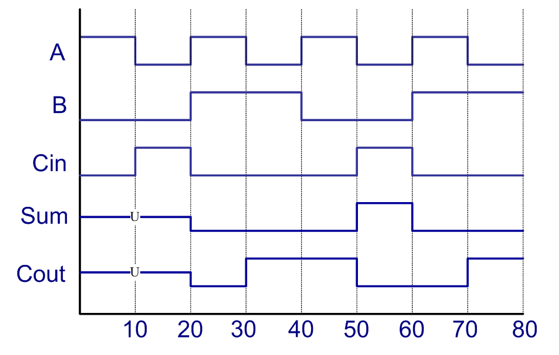

Task 1: Behavior Simulation of Full Adder (Week 2)
==================================================

.. contents:: Table of Contents

* Objective: Understand the simple concurrent signal assignment statement, the inertial delay model, and the simulation of a design. 

.. image:: ../_static/t1_1.png
    :align: center
    :width: 600

Knowledge Points
----------------
* Data Object
	- Signal, `p41-46 <http://marvalfan.top/lecture/chapter2.html#signal-data-objects>`_
	- Constant, `p49-50 <http://marvalfan.top/lecture/chapter2.html#constant-data-objects>`_
* `Data Type <http://marvalfan.top/lecture/chapter2.html#data-types>`_
	- bit, p51-53
	- array, enumeration, p56-57
	- std_logic, p58-60
* Operators, p61-65
	- Logic Operators: and, or, nand, nor, xor, xnor, 
	- Adding: +, -, & 
* Concurrent Statements 
	- simple concurrent signal assignment (CSA) statement, p71-74
* Delay Model
	- Inertial delay model, p86-88
* Test Bench 
	- Self study Chapter 5.3, p142-148

.. image:: ../_static/t1_2.png
    :align: center
    :width: 600

.. code:: 

	L1: s1 <= (A xor B) after gate_delay;
	L2: s2 <= (Cin and s1) after gate_delay;
	L3: s3 <= (A and B) after gate_delay;
	L4: sum <= (s1 xor Cin) after gate_delay;
	L5: cout <= (s2 or s3) after gate_delay;

