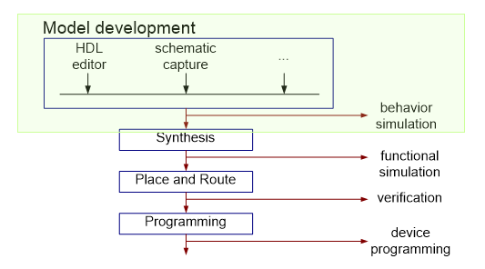
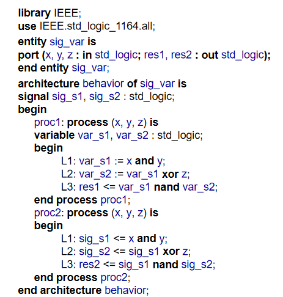
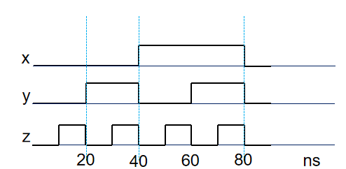

Task 2: Behavior Simulation of Process (Week 3)
===============================================

.. contents:: Table of Contents

* Objective: Understand the difference between the signal assignment and variable assignment in a process, understand the delta delay, and the simulation of a process.

Knowledge Points
----------------
* Data Object
	- Variable, p47-48
* Sequential VHDL
	 - Process, p94-99
	 - Sequential Statements p100-104, p118-121 
		* sequential signal assignment statement
		* variable assignment statement
* Delay Model
	- Delta delay model, p91-93
* Test Bench 
	- p142-159

Example: Signal assignment with process
---------------------------------------

