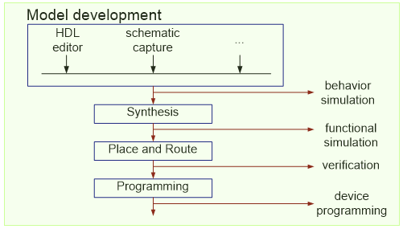
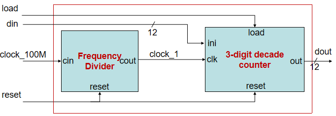
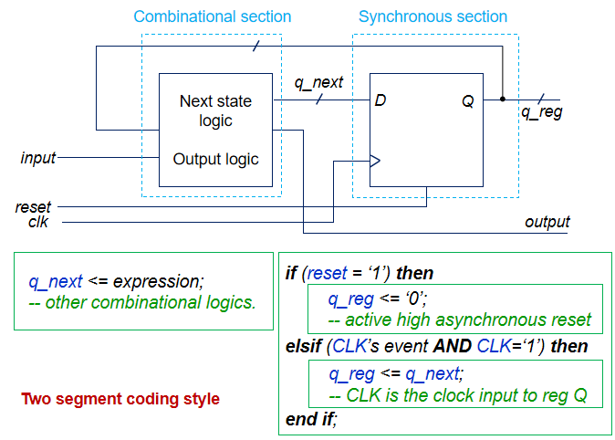

Task 3: Implement your First Design – 1Hz 3-digit decade Counter (Week 5)
=========================================================================

.. contents:: Table of Contents

* Objective: Understand the modeling based on the hierarchical structure, the two segment coding style for the design of a sequential circuit, and implement the design on the FPGA board.

Knowledge Points
----------------
* Concurrent Statements
	- Conditional signal assignment statement, `p78-81 <http://sustechvhdl.readthedocs.io/lecture/chapter3.html#conditional-signal-assignment>`_
* Sequential Statements
	- If statement, `p105-111 <http://sustechvhdl.readthedocs.io/lecture/chapter4.html#if-statement>`_
* Data Type
	- Signed, Unsigned, `p160-166 <http://sustechvhdl.readthedocs.io/lecture/chapter5.html#test-benches-that-compute-stimulus-and-expected-results>`_
* Modeling Structure
	- Component Declaration & Component instantiation, `p122-136 <http://sustechvhdl.readthedocs.io/lecture/chapter5.html#component>`_
	- Configuration `p137-141 <http://sustechvhdl.readthedocs.io/lecture/chapter5.html#configuration>`_
* Synthesize memory device
	- latch, `p182-185 <http://sustechvhdl.readthedocs.io/lecture/chapter6.html#latch>`_
	- flip-flop, `p186-191 <http://sustechvhdl.readthedocs.io/lecture/chapter6.html#flip-flops-f-f>`_
* Template for sequential circuit
	- two-segment coding style, `p192-196 <http://sustechvhdl.readthedocs.io/lecture/chapter6.html#vhdl-templates-for-sequential-circuits>`_
* `Counter <http://sustechvhdl.readthedocs.io/lecture/chapter6.html#synchronous-counter>`_
* Testbench for sequential circuits
	- system clock, `p206-207 <http://sustechvhdl.readthedocs.io/lecture/chapter6.html#generating-a-system-clock>`_
	- system reset, `p208-209 <http://sustechvhdl.readthedocs.io/lecture/chapter6.html#generating-the-system-reset>`_
	- stimulus generation, `p210-211 <http://sustechvhdl.readthedocs.io/lecture/chapter6.html#synchronizing-stimulus-generation-and-monitoring>`_

