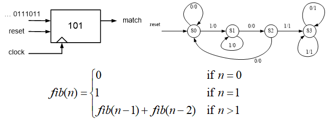
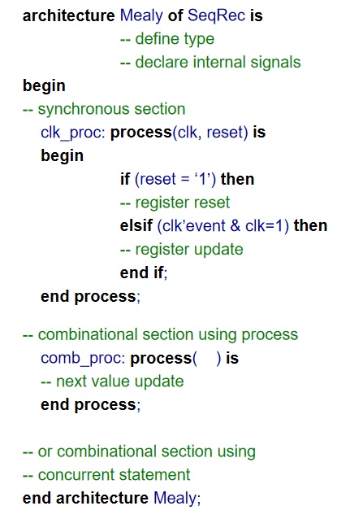
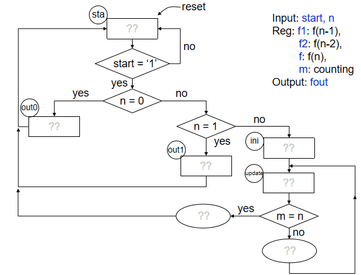

Task 4: FSM and FSMD (Week 6)
=============================

.. contents:: Table of Contents

Objective: Revision of the construction of finite-state machine (FSM); modeling, simulation and synthesis of FSM; Understand the FSM with a Datapath (FSMD) and  Algorithm State Machine (ASM) Chart, and modeling, simulation and synthesis of the FSMD. 

Knowledge Points
----------------
* Modeling FSM p213-221
	- Moore Machine
	- Mealy Machine
* Sequential Statement
	- case statement p112-116
	- NULL statement p117
* FSM with a Datapath (FSMD) p222
	- Algorithm State Machine (ASM) Chart p223-224
	- Modeling FSMD, p225-230

Sequential Recognizer
---------------------

ASMC for the Fibonacci Function
-------------------------------

