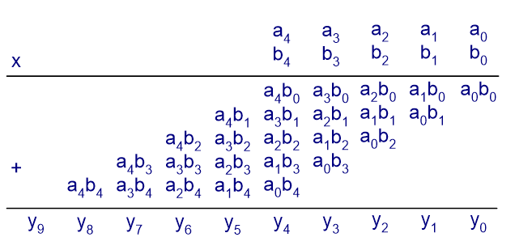
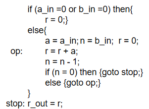
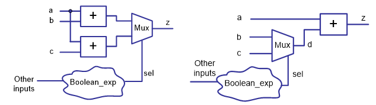
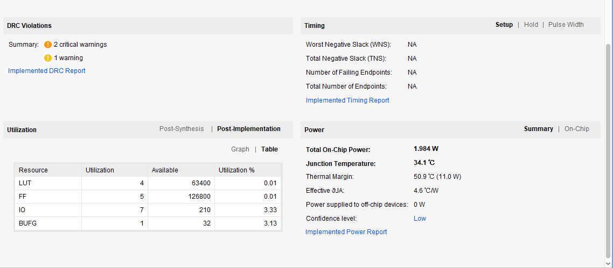
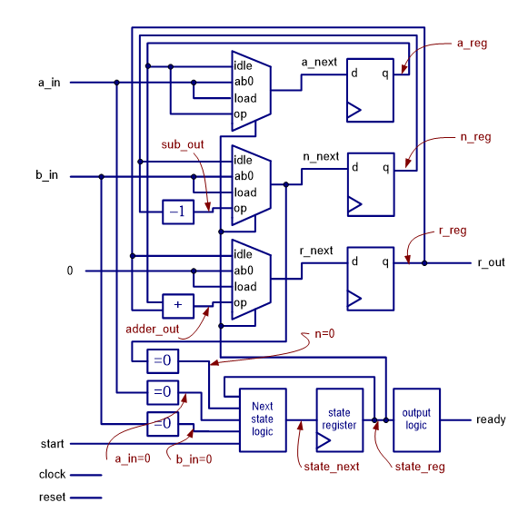

Task 5: Design Multipliers (Week 7)
===================================

.. contents:: Table of Contents

* Objective: Understand the combinational design and FSMD design, evaluate of the performance and cost of a design, and trade off between performance and cost.

**Combinational Design**

**FSMD Design**

Knowledge Points
----------------
* Combinational Design, p167-169, p175-181
	- Array aggregate p178
* Resource Sharing, p170-174
	- Cost and Performance: size, delay, power consumption
* FSMD Design (steps), p231-241
	- Defining the input and output signals
	- Converting the algorithm to an ASM chart
	- Constructing the FSMD
		* List all possible RT operations in the ASM chart.
		* Group RT operations according to their destination registers.
		* Derive the circuit for each group RT operation. 
		* Add the necessary circuits to generate the status signals.
	- VHDL descriptions of FSMD
* Resource sharing via FSMD, p242-249 

From the Project Summary, you can see the overview of the design.  Note in particular the Utilization, in which the number of LUT and FF, both used and in total, are shown in graphic and table forms, as well as Power consumption.

