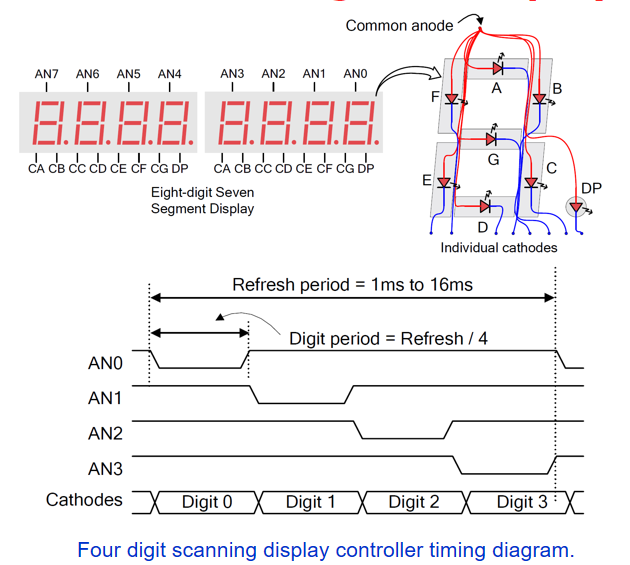
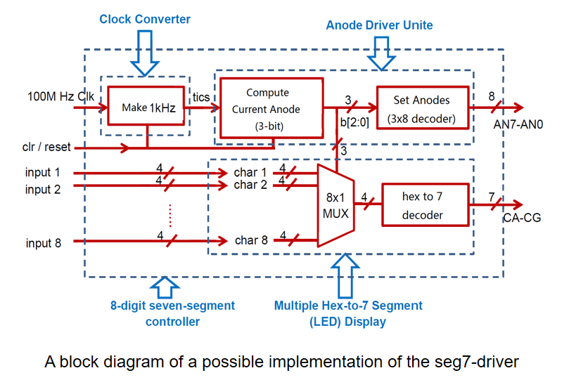

Task 6: Seven-Segment Display (Week 8)
======================================

* Objective: 
	- Revisit the knowledge points that we have studied.  
	- Get to know the operation of a device by reading its manual and/or other material.  Specifically in  this task, get to know the operation of the seven-segment LED display.
	- Start a design from its block diagram. 
	- Model each block, and 
	- Model the entire circuit that drives the seven-segment LED display.

Knowledge Points Revisited 
--------------------------
* Hierarchy design and Structure Style Modeling
* Two segment coding style
* Combinational circuit design
	- Decoder:
		* Hex to 7-segment decoder, 
		* 3-to-8 decoder 
	- Multiplexer
* Sequential circuit design
	- Counter
	- Frequency divider

New
---
* Parameterized Design p250-268
	- Generic constant p252-258
	- Array attribute p259-261
	- Unconstrained array p262-267 

Understand the 7-Seg LED Display
--------------------------------

