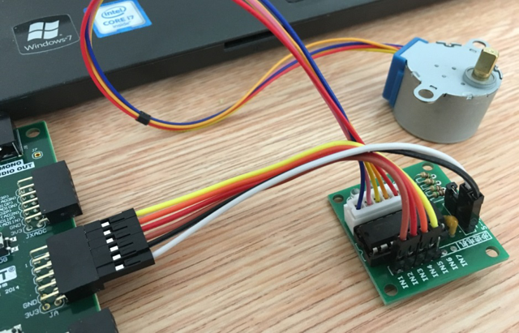
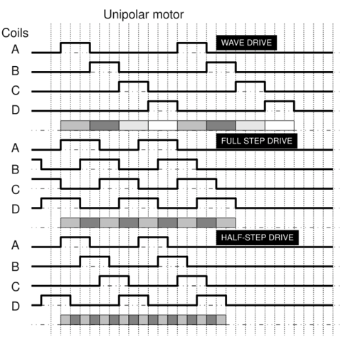

Task 7 Stepper Motor (week 9)
===================================

* Objective
	- Revisit the knowledge points that we have studied.  
	- Get to know the peripheral modules (Pmod) of Nexys4 DDR
	- Get to know the working principle of the step motor
	- Design a drive circuit for the step motor
	- Implement a drive circuit on the Nexys4 DDR FPGA board

Knowledge Points Revisited
--------------------------
* Hierarchy design and Structure Style Modeling
* Two segment coding style
* Combinational circuit design
	- Decoder:
		* 2-to-4 decoder 
* Sequential circuit design
	- Counter
	- Frequency divider
* Parameterized Design
	- Generic constant
	- Array attribute
	- Unconstrained array

.. image:: ../_static/t7_2.png
    :align: center
    :width: 600

