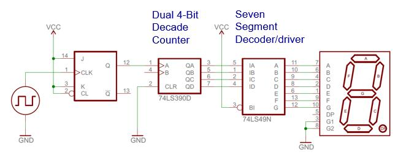
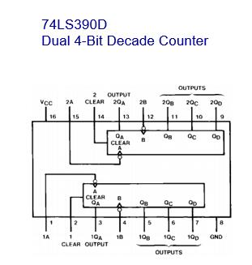
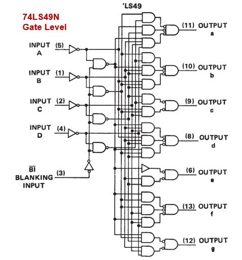
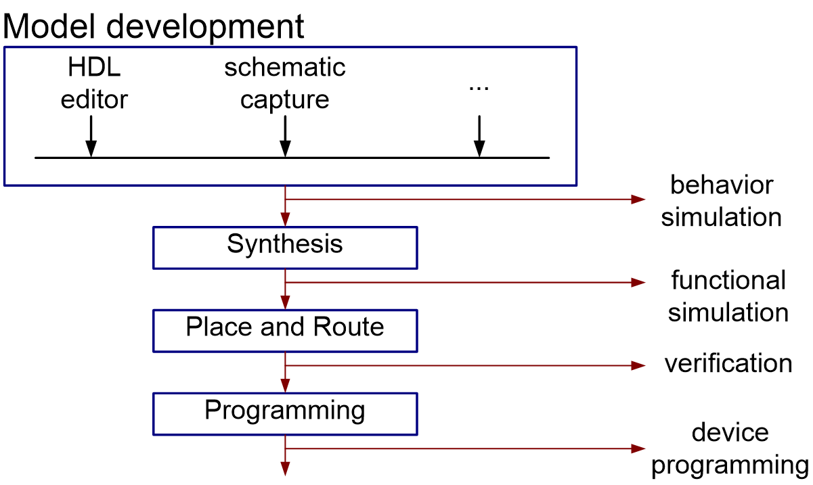
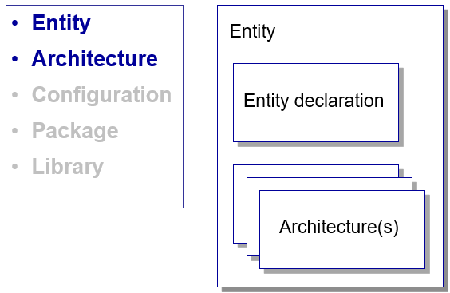
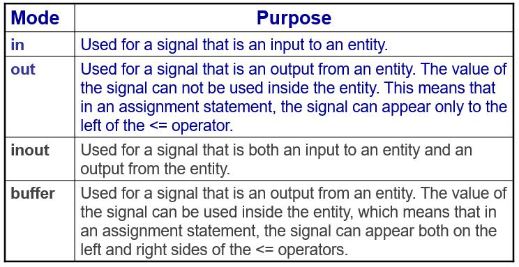
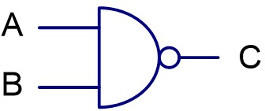
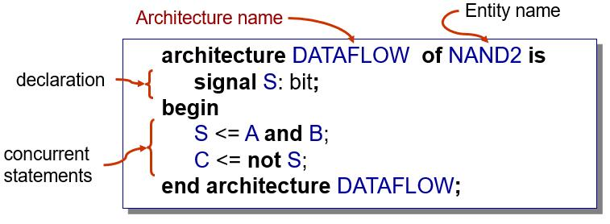

Introduction
=============

.. contents:: Table of Contents

Digital system design
----------------------
* Examples of Digital System: system level, or more accurately, register transfer level (RTL).

   
Abstraction
+++++++++++
* A key method of managing complexity is to describe a system in several levels of abstraction.
* An abstraction is a simplified model of the system, showing only the selected features and ignoring the associated details.

    * Transistor level
    * Gate level
    * Register transfer (RT) level
    * Processor level
    
System Representation (View)
++++++++++++++++++++++++++++
**View**: different perspectives of a system  

Behavior view 
^^^^^^^^^^^^^
* describe the functionalities and i/o behavior
* treat the system as a black box

Structural view 
^^^^^^^^^^^^^^^
* describe the internal implementation (components and interconnections)
* essentially block diagram

Physical view
^^^^^^^^^^^^^
* add more info to structural view: component size, component location, routing wires
* e.g. layout of a printed circuit board

What is VHDL
-------------

VHSIC Hardware Description Language (VHDL)
++++++++++++++++++++++++++++++++++++++++++
#. Very High-Speed Integrated Circuit program (VHSIC)
#. A computer language for documenting and simulating circuits, and describing circuits for synthesis.
#. A high level programming language with specialized constructs for modeling hardware.

History of VHDL
+++++++++++++++
#. Intermetrics, TI and IBM under US DoD contract 1983-1985: VHDL 7.2
#. IEEE standardization: VHDL 1076-1987
#. First synthesized chip, IBM 1988
#. IEEE Restandardization: VHDL 1076-1993
#. Minor change in standard 2000 and 2002
#. VHDL standard IEEE 1076-2008 published in Jan 2009

The role of HDL
++++++++++++++++
#. Formal documentation
#. Input to a simulator
#. Input to a synthesizer

FPGA design flow
++++++++++++++++

    
Basic VHDL concept 
-------------------

    
Entity
++++++
* It defines an interface to a component
* It names the entity, and 
* It describes the input and output ports that can be seen from the outside

    * Mode of signals (i.e. in and out)
    * Type of signals (i.e. bit)  

Possible modes for signals of entity ports

    
Architecture
++++++++++++
* It defines the relationships between the inputs and outputs of a design entity.
* It consists of a declaration section followed by a collection of concurrent statements. 
* It may be expressed in terms of behavior, data flow, or structure.  
* It provides an “internal view” of a component.

.. admonition:: Examples

    NAND2 Gate
    

    

    
.. code:: 

    S <= A and B;   
    C <= not S;     
    
.. code:: 

    C <= not S;
    S <= A and B;
    
``These two codes will produce the same result.``

**Architecture:Behavior style**

.. code:: 

    architecture BEHAVIOR  of NAND2 is
    begin
         process (A,B) is
         begin
             if (A=‘1’ and B=‘1’) then
                    C <= ‘0’;
             else 
                if (A=‘0’ and B=‘0’) or (A=‘0’ and B=‘1’) 		    
                    or (A=‘1’ and B=‘0’) then
                        C <= ‘1’;
                end if;
             end if;
         end process;
    end architecture BEHAVIOR;
