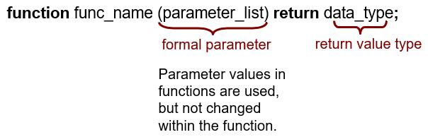
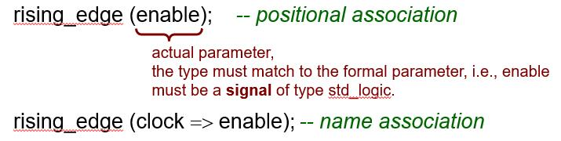
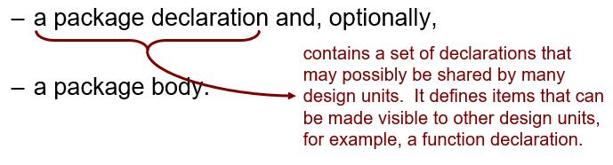

Subprograms, packages and libraries
======================================

.. contents:: Table of Contents

* For complex design, VHDL provides mechanics for structuring programs, reusing modules

    * Subprograms such as functions and procedures for encapsulating commonly used operations
    * Packages and libraries for sharing large bodies of code.

Functions
---------
* Functions are used to compute a value based on the values of the input parameters.
* Function declaration:
    

* Structure of a function

.. code::    

    function rising_edge (clock: std_logic) return boolean is
    --
    -- declarative region: declare variables local to the function
    --
    begin
    -- body
    -- sequential statement;
    -- sequential statement;
    -- --
    return (value);
    end function rising_edge;

* Calling a function in a VHDL module:

    
* Functions execute in zero simulation time.
    
    * Wait statement are not permitted in functions
    
.. code::
    
    entity dff is
    port (	D_in, CLK: in std_logic;
        D_out: out std_logic);
    end entity dff;
    architecture behavior of dff is
          function rising_edge(signal clock: in std_logic) return boolean is
        variable edge : boolean :=FALSE;
    begin
            edge := (clock=‘1’ and clock’event);
            return (edge);
    end function rising_edge;
    begin 
          process (CLK) is
          begin
            if (rising_edge(CLK)) then
            D_out <= D_in;
            end if;
          end process;
    end architecture behavior;

**A majority function**    

* It returns ‘1’ if two or more of the 3 input parameters, a, b and c are ‘1’.  
* It can be treated as a shorthand for the ab+ac+bc expression

.. code::

	architecture arch of …
	      -- declaration
	      function maj(a, b, c: std_logic) return std_logic is
	      	variable result: std_logic;
	      begin
	      	result := (a and b) or (a and c) or (b and c);
	      	return result;
	      end function maj;
	      signal i1, i2, i3, i4, x, y: std_logic;
	begin
	      …
	      x <= maj(i1, i2, i3) or i4;
	      y <= i1 when maj(i2, i3, i4)=‘1’ else …
	end arch;
	
**Type conversion functions**

* To make assignment from an object of one type to an object of another type.

    * for example: bit_vector and std_logic_vector.

.. code::

    function to_bitvector (svalue: std_logic_vector) return bit_vector is
        variable outvalue : bit_vector(svalue’length - 1 downto 0);
    begin
        for i in svalue’ range loop -- scan all elements of the array
                 case svalue(i) is
                when ‘0’ => outvalue (i) := ‘0’;
                when ‘1’ => outvalue (i) := ‘1’;
                when others => outvalue (i) := ‘0’;
                 end case;
        end loop;
        return outvalue;
    end function to_bitvector;

A Function performing log :sub:`2` n

.. code::

    function log2c (n: integer) return integer is
        variable m, p: integer;
    begin
        m := 0;
        p := 1;
        while p < n loop
               m := m+1;
               p := p*2;
        end loop;
        return m;
    end function log2c;

**Summary**    

* Unlike entity and architecture, functions (and procedures) are not design units and thus cannot be processed independently.
* In synthesis, functions should not be used to specify the design hierarchy, but should be treated as a shorthand for simple, repeatedly used operations.
* A function can be thought of as an extension of the expression and can be “called” whenever an expression is used. 

Package
---------
* The primary purpose of a package is to collect elements that can be shared (globally) among two or more design units.  A package is represented by:

    
* Package declaration and package body are design units of VHDL.

**An example of a package declaration**

.. code::

    package SYNTH_PACK is
         constant LOW2HIGH : TIME := 20ns;
         type ALU_OP is (ADD, SUB, MUL, DIV, EQL);
         type MVL is (‘U’, ‘0’, ‘1’, ‘Z’);
         component NAND2
        port (A, B : in MVL; C : out MVL);
         end component;
         -- subprogram, type, constant, signal, variable, component …, 
         -- and use clause can be declared in package declaration
    end package SYNTH_PACK;

* If the declarations include items such as functions or procedure declarations, the behavior of the function and procedure are specified in a separate design unit called the package body.

.. code::

    use WORK.SYNTH_PACK.all;

    package PROGRAM_PACK is
         constant PROP_DELAY : TIME;
         function ISZERO(A: MVL) return boolean;
    end package PROGRAM_PACK;

* In this case, a package body is required.
* A package body primarily contains the behavior of the subprograms declared in a package declaration.  It may also contain other declarations.
    
** An example of a package body **

.. code::

    package body PROGRAM_PACK is
         constant PROP_DELAY : TIME := 15ns;
         function ISZERO(A: MVL) return boolean is
         begin
        if (A=‘0’) return TRUE;
        else return FALSE;
        end if;
         end function ISZERO;
    end package body PROGRAM_PACK;
    
.. Note::    

    An item declared inside a package body has its scope restricted to be within the package body, and this item cannot be made visible in other design unit. (This is in contrast to items declared in a package declaration).

Design libraries 
-----------------
* Each design unit - entity, architecture, configuration, package declaration, package body is analyzed (complied) and placed in a design library for subsequent use.
* To use a design library, the library must be declared by  its logical name. ``library logical-library-name1, logical-library-name2,…;``
* In VHDL, the libraries **STD** and **WORK** are implicitly declared.
* Once a library is declared, all of the functions, procedures, and type declaration of a package in that library can be made accessible to a VHDL model through the use clause. ``library IEEE``, ``use IEEE.std_logic_1164.all;``
* These clauses apply only to the immediate entity-architecture pair! **Visibility must be established for other design units separately!**

    