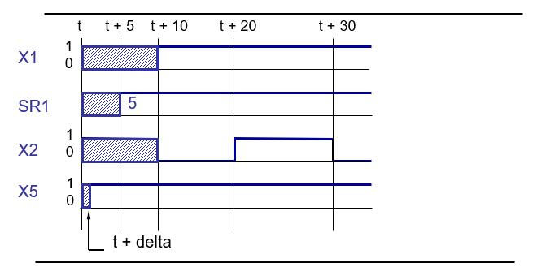
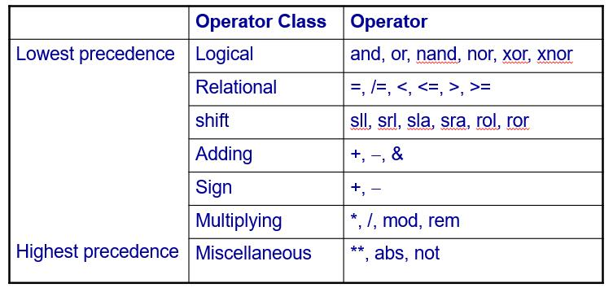
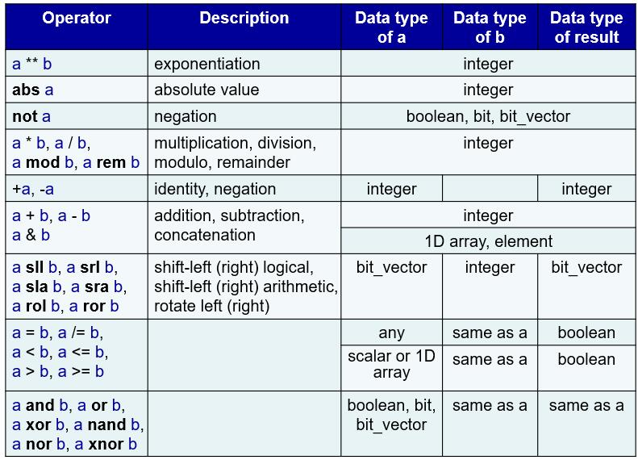
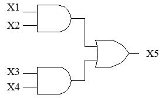
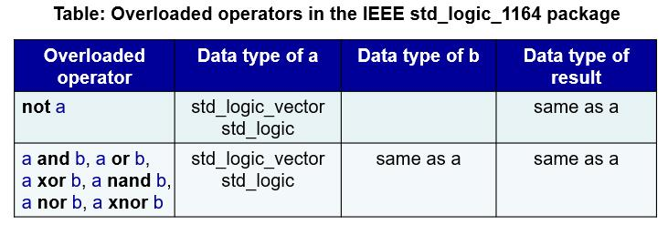
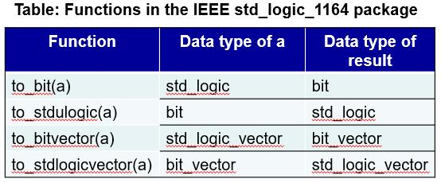

Data Objects and Operands
======================================

.. contents:: Table of Contents

Data objects
------------
* An object in VHDL is a named item that holds the value of a specific data type.
* Four kinds of data objects

    * Signals
    * Constants
    * Variables
    * File
    
* For describing logic circuits, the most important data objects are signals.  They represent the logic signals (wires) in the circuit.

Signal data objects
++++++++++++++++++++

* A signal is an object that holds the current and possible future values of the object.
* They occur as inputs and outputs in port descriptions, as signals in architecture, etc.

**Where can signal data objects be declared?**

* Entity declaration
* Declarative section of an architecture
* Cannot be in a process

.. code::

    entity nand2 is
    port (A, B:    in  bit;
             C     :    out  bit );
    end entity nand2;

    architecture dataflow  of nand2 is
        signal S: bit;
    begin
        S <= A and B;
        C <= not S;
    end architecture dataflow;

**How to declare a signal?**

``signal signal_name : signal_type [:= initial_value];``

**Examples:**

.. code::

    signal status : std_logic := ‘0’;
    signal data : std_logic_vector (31 downto 0);

**Signal assignment**

A signal assignment schedules a new value to occur at some future time. **The current value of the signal is never changed.** If no specific value of time is specified the default value is infinitesimally small value of time into the future called delta time. 
Signals are assigned using the “<=“ operator. e.g.

.. code::

	X1 <= ‘1’ after 10ns;
	SR1 <= 5  after 5ns;
	X2 <= ‘0’ after 10ns, ‘1’ after 20ns, ‘0’ after 30ns;
	X5 <= ‘1’;

The figure above shows the timing implied by the statements shown in the previous slides assuming that all statements executed at time *t*.

Variable data objects
+++++++++++++++++++++

Variables are used to hold temporary data.

**Where to declare a variable?**

within the processes, functions and procedures in which they are used 

**How to declare a variable?**

``variable variable_name : variable_type [:= initial_value];``

**Examples:**

.. code::

    variable address : bit_vector (15 downto 0) := x”0000”;
    variable index: integer range 0 to 10 := 0;

**Variable assignment**

In contrast to signal assignment, a variable assignment takes effect immediately. **Variables are assigned using the “:=“ operator. e.g.**

.. code::

	A := ‘1’;
	ROM_A(5) := ROM_A(0);
	STAR_COLOR := GREEN;

Constant data objects
+++++++++++++++++++++
A constant is an object which is initialized to a specific value when it is created, and which cannot be subsequently modified.
**Where can constants be declared?**

* Declarative section of an architecture
* Declarative section of a process

**How to declare a constant?**
    
``constant constant_name : constant_type [:= initial_value];``

**Examples:**

.. code::

    constant yes : boolean := TRUE;
    constant msb : integer := 5;

Data types
----------

* The type of a signal, variable, or constant object specifies:

    * the range of values it may take
    * the set of operations that can be performed on it.
    
* The VHDL language supports a predefined standard set of type definitions as well as enables the definition of new types by users.
    
**8 types commonly used:**

* ``bit`` 
* ``bit_vector`` 
* ``integer``
* ``boolean``
* ``array`` 
* ``enumeration`` 
* ``std_logic``
* ``std_logic_vector``

**Bit and Bit_vector**

Bit type has two values, ‘0’ and ‘1’.  
 
Example: 

.. code::

    signal a : bit := ‘0’;
    variable b : bit ; 

Bit_vector is an array where each element is of type bit.

Example:

.. code::

    signal c : bit_vector (3 downto 0) := “1000”; -- recommended
    signal d : bit_vector (0 to 3) := “1000”;
 

**INTEGER type**: INTEGER type represents positive, negative numbers and 0. 
 
By default, an INTEGER signal has 32 bits and can represent numbers from -231 to 231-1. The code does not specifically give the number of bits in the signal.
 
Integers with fewer bits than 32 can be declared, using the RANGE keyword. 

**Example:**

.. code::

    signal x : integer range -128 to 127;
 
This defines x as an eight-bit signed number. 

**BOOLEAN type**

An object of type BOOLEAN can have the values TRUE or FALSE, where TRUE is equivalent to 1 and FALSE to 0.
 
**Example:**

.. code::

	signal flag : boolean; 
	constant correct : boolean := TRUE;

**ENUMERATION type**    

An ENUMERATION type is defined by listing all possible values of that type.  All of the values of an enumeration type are user-defined. 
 
``type enumerated_type_name is  (name {, name});``
 
The most common example of using the ENUMERATION type is for specifying the states for a finite-state machine.
 
**Example:**

.. code::

	type State_type is (stateA, stateB, stateC);
	signal y : State_type := stateB ;
 
When the code is translated by the VHDL compiler, it automatically assigns bit patterns (codes) to represent stateA, stateB and stateC. 

**ARRAY type**

ARRAY types group one or more elements of the same type together as a single object. 
 
type array_type_name is array (index_range) of element_type;
 
**Example:**

.. code::

	type byte is array (7 downto 0) of bit;
	type word is array (15 downto 0) of bit;
	type memory is array ( 0 to 4095 ) of word;
     
	signal program_counter: word := ”0101010101010101”;
	variable data_memory: memory;
 

* To refer individual elements of array: 	

    * program_counter(5 downto 0) accesses the 6 LSBs of program_counter.  
    * data_memory(0) accesses the first record in memory.  

**std_logic and std_logic_vector**

std_logic provides more flexibility than the bit.
To use, you must include the two statements:
 
.. code::

     library ieee;
     use ieee.std_logic_1164.all;

std_logic_vector type represents an array of std_logic objects.

.. code::

    type std_logic is
    (  
        ‘U’, 	-- uninitialized
        ‘X’, 	-- unknown
        ‘0’, 	-- forcing 0	
        ‘1’, 	-- forcing 1 	
        ‘Z’,   	-- high impedance
         ‘W’, 	-- weak unknown
        ‘L’, 	-- weak 0
        ‘H’, 	-- weak 1 
         ‘-’     	-- don’t care
    );

**Example**

.. code::

    signal x1,x2,Cin,Cout,Sel	: std_logic;
    signal C		: std_logic_vector (1 to 4);
    signal X,Y,S		: std_logic_vector (3 downto 0); 

**std_logic** objects are often used in logic expressions.
**std_logic_vector** objects can be used as binary numbers in arithmetic circuits by including in the code the following statement ``use ieee.std_logic_signed.all; `` or ``use ieee.std_logic_unsigned.all;`` 
    
**VHDL is strongly typed**

* VHDL is a strongly type-checked language. Even for objects that intuitively seem compatible, like bit and std_logic, one cannot be assigned to another.
* use std_logic and std_logic_vector types (Recommendation)

Operators
---------

**1. Logic operators**

E.g. ``sig <= “11001” and “10011’; sig gets value “10001”``
    
Operators on the same line have equal precedence and must be **parenthesized** when necessary.

    
``X5 <= (X1 and X2) or (X3 and X4 );``

**2. Concatenation &**

E.g. ``sig2 <= “001” & sig (3 downto 1); sig2 gets value “001000”``

    

    
**Use of conversion functions**

.. code::

    signal s1, s2, s3: std_logic_vector(7 downto 0);
    Signal b1, b2: bit_vector(7 downto 0);

The following statements are **wrong** because of data type mismatch
    
.. code::

    s1 <= b1;  -- bit_vector assigned to std_logic_vector
    b2 <= s1 and s2; -- std_logic_vector assigned to bit_vector
    s3 <= b1 or s2; -- or is undefined between bit_vector and std_logic_vector

We can use the conversion function to correct these problems

.. code::

    s1 <= to_stdlogicvector(b1);  
    b2 <= to_bitvector(s1 and s2); 
    s3 <= to_stdlogicvector(b1) or s2; -- or
    s3 <= to_stdlogicvector(b1 or to_bitvector(s2)); 
    
Lexical elements
----------------
* The lexical elements are the basic syntactical units in a VHDL program.
* comments,
* identifiers,
* reserved words,
* number, characters and strings.

Comments
++++++++
* A comment starts with two dashes, --, followed by the comment text.
* The comments are for documentation purpose only.

.. code::

    -- **********************************************
    -- example of entity
    -- **********************************************
    entity example is 
    --……
    end entity example;
    
Identifier
+++++++++++
* Identifiers are used as names for signals, variables, constants, as well as entities, architectures and so on.
* A basic identifier is a sequence of characters that may be

    * upper or lower case letters and digits 0 - 9
    * underscore (“_”) character
    
* VHDL language is **NOT** case sensitive.
* The first character must be a letter and the last character must **NOT** be “_”
* Two successive underscores “__” are **NOT** allowed.

    * Select, ALU_in, Mem_data, Two_dash_ok      **(true)**
    * 12Select, _start, out\_, Not__Allow, dot#3  **(false)**

Preserved words
+++++++++++++++
Some words are reserved in VHDL to form the basic language constructs.

.. 
   
    abs, access, after, alias, all, and, architecture, array, assert, attribute, begin, block, body, buffer, bus, case, component, configuration, constant, disconnect, downto, else, elsif, end, entity, exit, file, for, function, generate, generic, guarded, if, impure, in, inertial, inout, is, label, library, linkage, literal, loop, map, mod, nand, new, next, nor, not, null, of, on, open, or, others, out, package, port, postponed, procedure, process, pure, range, record, register, reject, rem, report, return, rol, ror, select, severity, shared, signal, sla, sll, sra, srl, subtype, then, to, transport, type, unaffected units, until, use, variable, wait, when, while, with, xnor, xor
    
Numbers, characters and strings
+++++++++++++++++++++++++++++++++
* A Number in VHDL can be

    * integer, such as 0, 1234, and 98E7
    * real, such as 0., 1.23456, or 9.87E6
    * represented in other number bases:
    
        * 45 = 2#101101# = 16#2D#
        
* A character in VHDL is enclosed in single quotation marks,

    * such as ‘A’, ‘Z’, ‘3’.
    * 1 and ‘1’ are different.
    
* A string in VHDL is a sequence of characters enclosed in double quotation marks:

    * such as “Hello”, “10000111”.
    * 2#10110010# and “10110010” are different

