Concurrent statement
======================================

.. contents:: Table of Contents

* The operation of digital system is inherently concurrent.
* Within VHDL signals are assigned values using signal assignment statements.``sum <= (x xor y) after 5 ns``

* Multiple signal assignment statements are executed concurrently in simulated time and are referred to as concurrent signal assignment statements (CSAs).
* There are several forms of CSA statements:
   
    * Simple CSA
    * Conditional signal assignment
    * Selected Signal assignment

Simple CSA
----------

.. code::

    architecture concurrent_behavior of half_adder is
    begin
        sum <= ( x xor y) after 5 ns;
        carry <= (x and y) after 5 ns;
    end architecture concurrent_behavior;

* General form: ``target <= expression;``
    expression is logical, comparative or arithmetic operations. 
* The execution of the statements is determined by the flow of signal, rather than textual order.

.. admonition:: Examples

    Half_adder
    
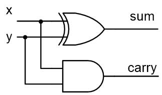
    
    
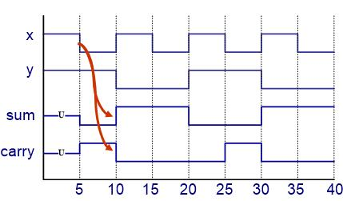
    
    
.. code::

    library IEEE;
    use IEEE.std_logic_1164.all;
    entity half_adder is
    port (x, y : in std_logic;
            sum, carry : out std_logic);
    end entity half_adder;
    
    architecture concurrent_behavior of half_adder is
    begin
        sum <= ( x xor y) after 5 ns;
        carry <= (x and y) after 5 ns;
    end architecture concurrent_behavior;

.. admonition:: Examples

    Full_adder    

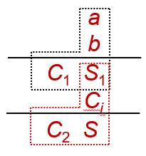
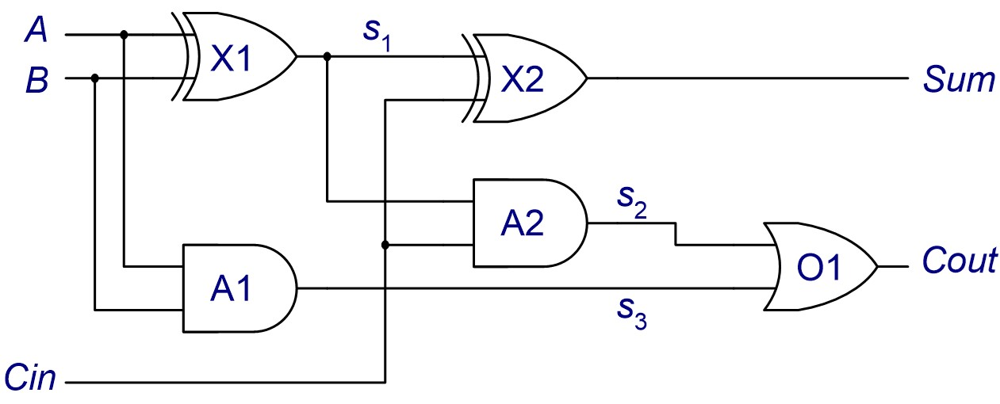
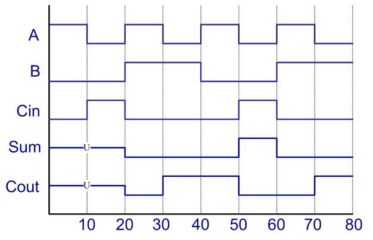

.. code::
    
    library IEEE;
    use IEEE.std_logic_1164.all;
    entity full_adder is
    port (A, B, Cin : in std_logic;
            Sum, Cout: out std_logic);
    end entity full_adder;
    
.. code::

    architecture dataflow of full_adder is
        signal s1, s2, s3 : std_logic;
        constant gate_delay : time := 10 ns;
    begin
        L1: s1 <= (A xor B) after gate_delay;
        L2: s2 <= (Cin and s1) after gate_delay;
        L3: s3 <= (A and B) after gate_delay;
        L4: sum <= (s1 xor Cin) after gate_delay;
        L5: cout <= (s2 or s3) after gate_delay;
    end architecture dataflow;
    
.. code::

	L1: s1 <= (A xor B) after gate_delay;
	L2: s2 <= (Cin and s1) after gate_delay;
	L3: s3 <= (A and B) after gate_delay;
	L4: sum <= (s1 xor Cin) after gate_delay;
	L5: cout <= (s2 or s3) after gate_delay;
    
Conditional signal assignment
-----------------------------
* Simple CSAs is convenient for describing gate-level circuits whose behavior can be expressed with Boolean equations.
* It is useful to model circuits at higher levels of abstraction such as multiplexors and decoders. 

.. admonition:: Examples
 
    4-to-1, 8-bit multiplexor

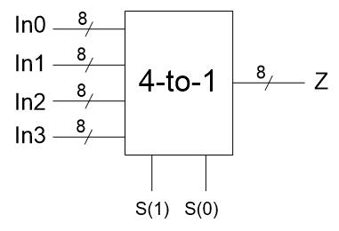
        
.. code::

    library IEEE;
    use IEEE.std_logic_1164.all;
    entity mux4 is
    port (In0, In1, In2, In3 : in std_logic_vector (7 downto 0);
            S: in std_logic_vector(1 downto 0);
            Z : out std_logic_vector (7 downto 0) );
    end entity mux4;
    
.. code::

    architecture con_arch1 of mux4 is
    begin
        Z <=In0 when S = “00” else
            In1 when S = “01” else 
            In2 when S = “10” else
            In3;
    end architecture con_arch1;
    
.. code::

    architecture con_arch2 of mux4 is
    begin
    Z <= In0 when S = “00” else
         In1 when S = “01” else 
         In2 when S = “10” else
         In3 when S = “11” else
         “XXXXXXXX”;
    end architecture con_arch2;

* The conditional signal assignment itself is a concurrent signal assignment.
* It has one target, but can have more than one expression. 

.. code-block::
    :caption: General form:

    target <=   {expression} when {condition} else
                {expression} when {condition} else
                …… 
                {expression}; 

                
* When this CSA is executed, the expressions in the right hand side are evaluated in the order that they appear. 
* The order of the expressions with their respective conditions inside the statement is important. 
* Even there are several lines of text, this corresponds to only one signal assignment statement. 

.. admonition:: Examples

    4-to-2 priority encoder

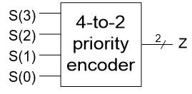
    
``Assume that S(3) has the highest priority``

.. code::

    library IEEE;
    use IEEE.std_logic_1164.all;
    entity pr_encoder is
    port (S: in std_logic_vector(3 downto 0);
            Z : out std_logic_vector (1 downto 0) );
    end entity pr_encoder;

.. code::

    architecture con_behavioral of pr_encoder is
    begin
        Z <=“11” when S(3) = ‘1’ else
            “10” when S(2) = ‘1’ else 
            “01” when S(1) = ‘1’ else
            “00” when S(0) = ‘1’ else
            “00”;
    end architecture con_behavioral;

Selected signal assignment
--------------------------
* It is similar to the conditional signal assignment statement.
* The value of a target signal is determined by the value of a select expression.

.. admonition:: Examples

    the same 4-1 multiplexer.
    
.. code::

    architecture sel_behavioral of mux4 is
    begin
        with S select
            Z <= In0 when “00”,
                 In1 when “01”,
                 In2 when “10”,
                 In3 when others;
    end architecture sel_behavioral;

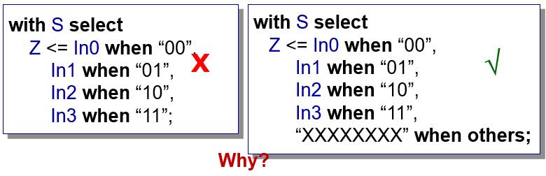

.. admonition:: Examples

    4-to-2 priority encoder based on a selected signal assignment statement

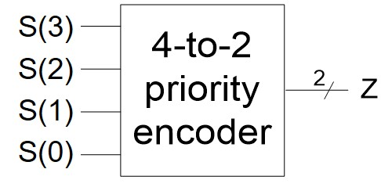

.. image:: ../_static/c3_right.jpg
    :align: right
    :width: 150
    
.. code::

    architecture sel_arch of pr_encoder is
    begin
        with S select
            Z <= “11” when “1000” | “1001” | “1010” | “1011” |
                                 “1100” | “1101” | “1110” | “1111”,
                 “10” when “0100” | “0101” | “0110” | “0111”,
                 “01” when “0010” | “0011”,
                 “00” when others;
    end architecture behavioral

    
.. code::
    
    architecture sel_arch of pr_encoder is
    begin
        with S select
            Z <= “11” when “1---”,
                 “10” when “01--”,
                 “01” when “001-”,
                 “00” when others;
    end architecture behavioral

* The choices for the select expression are not evaluated in sequence.
* All choices are evaluated, but one and only one must be true.
* All of the choices that the programmer specifies must cover all the possible values of the select expression.
* When an event occurs on a signal used in the select expression, or any of the signals used in one of the choices, the statement is executed.  

Understanding delays
--------------------
* Accurate representation of the behavior of digital circuits requires accurate modeling of delays through the various components.
* Three types of delay models

    * Inertial delay model
    * Transport delay model
    * Delta delay

The inertial delay model
++++++++++++++++++++++++
* Digital circuits takes a finite amount of time for the output of a gate to respond to a change on the input.
* This implies that the change on the input has to persist for a certain period of time to ensure that the output will response.
* If it does not persist long enough the input events will not be propagated to the output.
* This propagation delay model is referred to as the inertial delay model.  
    
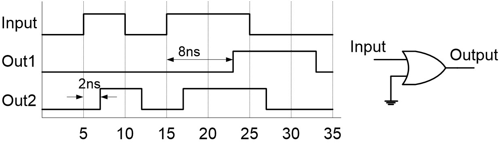

``Out1 <= Input or ‘0’ after 8 ns;
Out2 <= Input or ‘0’ after 2 ns;``

* Any pulse in the input with a width of less than the propagation delay through the gate is said to be rejected. 
* often used for component delays
* Default in VHDL program

The transport delay model
+++++++++++++++++++++++++
Transport delay models the delays in hardware that do not exhibit any inertial delay. 
This delay represents pure propagation delay; that is, any changes on an input are transported to the output, no matter how small of the width, after the specified delay.
Keyword **transport** is used in a signal assignment statement for transport delay model.

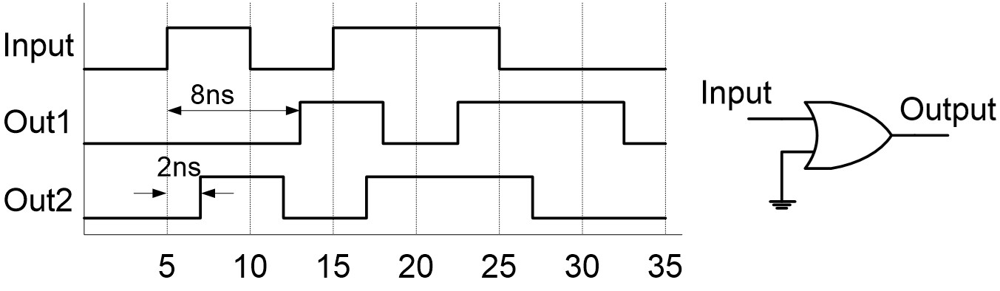

``Out1 <= transport (Input or ‘0’) after 8 ns;
Out2 <= transport (Input or ‘0’) after 2 ns;``

* Pulses are propagated, irrespective of width
* good for interconnect delays.

Delta Delays
++++++++++++
* If we do not specify a delay for the occurrence of an event on a signal, for example ``sum <= (x xor y);`` a **delta delay** is assumed by the simulator 
* Delta delay is an infinitesimally small delay.
* In a signal assignment, the value is not assigned to the signal directly but after a delta delay at the earliest. 
* Delta delays are simply used to enforce dependencies between events and thereby ensure correct simulation.

.. admonition:: Examples

    combinational
    
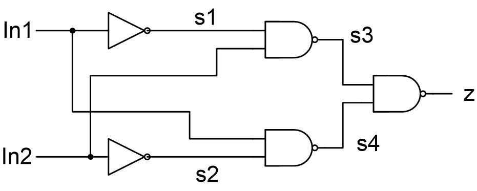
    
.. code::

    library IEEE;
    use IEEE.std_logic_1164.all;
    entity combinational is
    port (In1, In2 : in std_logic;
            z : out std_logic);
    end entity combinational;

    architecture behavior of combinational is
         signal s1, s2, s3, s4 : std_logic := 0;
    begin
         s1 <= not In1;
         s2 <= not In2;
         s3 <= not (s1 and In2);
         s4 <= not (s2 and In1);
         z <= not (s3 and s4);
    end architecture behavior;

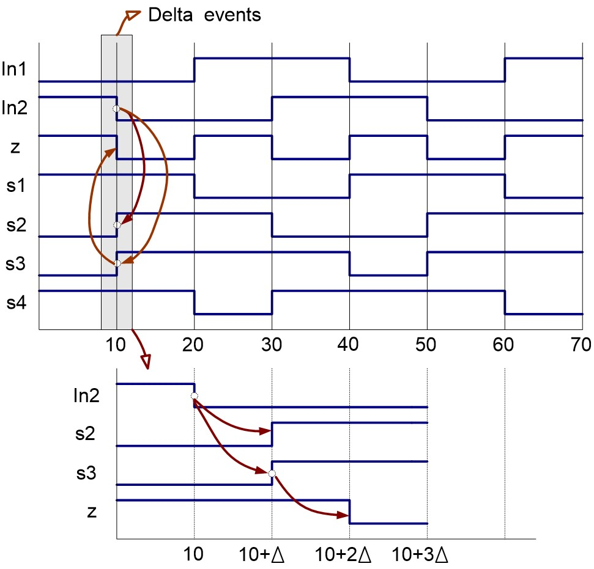
