Sequential statement
======================================

.. contents:: Table of Contents

* Sequential statements are specified inside a process.
* Processes represent fundamental method by which concurrent activities are modeled. 

The process construct
----------------------
    
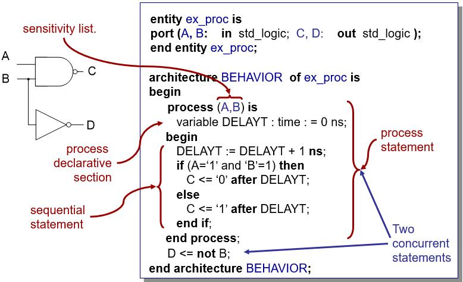

* A process is a large concurrent statement that itself contains a series of sequential statements.
* The body of the process is treated by VHDL as a single concurrent statement and is executed at the same time as all other concurrent statements in the simulation. 
    
Process with a sensitivity list
+++++++++++++++++++++++++++++++
The sensitivity list is a list of signal to which the process responds.
	
.. code::

    signal a, b, c, y: std_logic; -- in architecture declaration
    …
    process (a, b, c) -- in architecture body
    begin
        y <= a and b and c; -- infer a combinational circuit
    end process;

.. code::

    signal a, b, c, y: std_logic; 
    …
    process (a) -- a process with incomplete sensitivity list
               -- not infer a combinational circuit
    begin
        y <= a and b and c;
    end process;

Process with a wait statement
+++++++++++++++++++++++++++++
A process with wait statements has one or more wait statement but no sensitivity list.

#.  **wait on** signals;
#.  **wait until** boolean_expression;
#.  **wait for** time_expression;

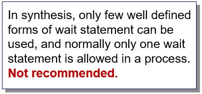
    
.. code::
 
    process
    begin
        y <= a and b and c;
        wait on a, b, c;
    end process;

        
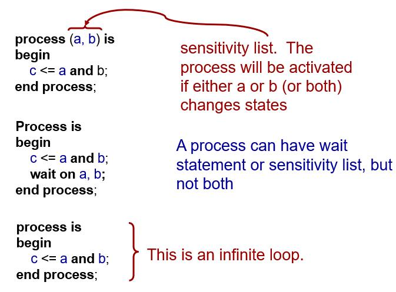

Sequential statements
---------------------
sequential signal assignment statement
++++++++++++++++++++++++++++++++++++++
``Signal-object <= expression [after delay-value];``

* Outside a process – concurrent signal assignment statement
* Within a process – sequential signal assignment, executed in sequence with respect to the other sequential statement which appear within that process.
* When a signal assignment statement is executed, the value of expression is computed immediately, and this computed value is scheduled to be assigned to the signal after the specified delay.

* Inside a process, a signal can be assigned multiple times.  If all assignments are with 𝛿-delay, only the last assignment takes effect.

.. code::

    signal a, b, c, d, y: std_logic; 
    …
    process(a, b, c, d)
    begin
        y <= a or c;
        y <= a and b;
        y <= c and d;
    end process;

.. code::

    signal a, b, c, d, y: std_logic; 
    …
    process(a, b, c, d)
    begin
        y <= c and d;
    end process;

* Although this segment is easy to understand, multiple assignment may introduce subtle mistakes in a more complex code and make synthesis very difficult.

* Unless there is a compelling reason, it is a good idea to avoid assign a signal multiple times in a process.  The **only exception** is the assignment of a default value in the if and case statement.
* The result will be very different if the multiple assignments are the concurrent signal assignment statements

.. code::

    signal a, b, c, d, y: std_logic; 
    …
    -- the statements are not inside a process
    y <= a or c;
    y <= a and b;
    y <= c and d;

* The above code is syntactically correct.
* However, the design is incorrect because of the potential output conflict.

variable assignment statement
+++++++++++++++++++++++++++++

* Variables can be declared and used inside a process statement.
* Variable assignment statement: ``variable-object := expression;``
* Variable assignment is immediate.

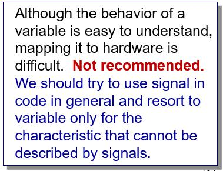
    
.. code:: 

    Signal a, b, y : std_logic;
    ……
    process (a, b) is
         variable temp : std_logic; 
         begin
        temp := ‘0’;
        temp := temp or a;
        temp := temp or b;
        y <= temp;
    end process;

if statement
++++++++++++
* An if statement selects a sequence of statements for execution based on the value of a condition.
* General form of an if statement

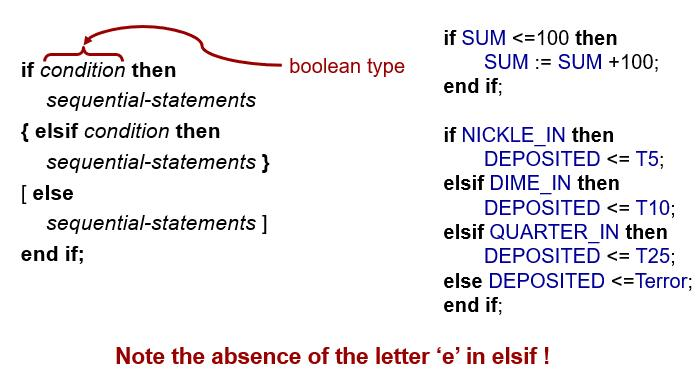

.. admonition:: Examples

    4-to-1 multiplexer based on an if statement

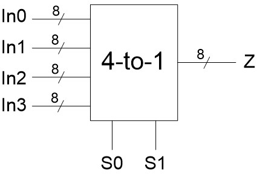
    
.. code:: 
    
    architecture if_arch of mux4 is
    begin
        process(In0, In1, In2, In3, S)
        begin
            if (S = “00”) then
                Z <= In0;
            elsif (S = “01”) then
                Z <= In1;
            elsif (S = “10”) then
                Z <= In2;
            else Z <= In3;
            end if;
        end process;
    end if_arch;
    

.. admonition:: Examples

    4-to-2 priority encoder based on an if statement

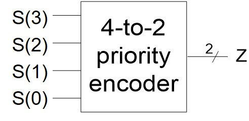
    
.. code:: 

    architecture if_arch of pr_encoder is
    begin
        process(S)
        begin
            if (S(3) = ‘1’) then
                Z <= “11”;
            elsif (S(2) = ‘1’) then
                Z <= “10”;
            elsif (S(1) = ‘1’) then
                Z <= “01”;
            else Z <= “00”;
            end if;
        end process;
    end if_arch;

Comparison to a conditional assignment statement
^^^^^^^^^^^^^^^^^^^^^^^^^^^^^^^^^^^^^^^^^^^^^^^^^
* An if statement is somewhat like a concurrent conditional signal assignment statement.

.. code::

    sig <= value_exp1 when boolean_exp1 else 
          value_exp2 when boolean_exp2 else
          value_exp3 when boolean_exp3 else
          …
          value_expn;

.. code::

    Process(…)
    begin
    if boolean_exp1 then sig <= value_exp1;
    elsif  boolean_exp2 then sig <= value_exp2;
    elsif  boolean_exp3  then sig <= value_exp3;
    …
    else sig <= value_expn;
    end if;
    end process;
          
* The above two statements are equivalent.
* In general, equivalent only if each branch of the if statement consists of a single assignment of the same single signal.
* An if statement allows for arbitrary nesting of if statement.

.. code::
    
    process (CTRL1, CTRL2)
    begin
       if CTRL1 = ‘1’ then
    if CTRL2 = ‘0’ then
        MUX_OUT <= “0010”;
    else
        MUX_OUT <= “0001”;
    end if;
       else
    if CTRL2 = ‘0’ then
        MUX_OUT <= “1000”;
    else 
        MUX_OUT <= “0100” 
    end if;
       end if;
    end process;

Incomplete if branch
^^^^^^^^^^^^^^^^^^^^
* In VHDL, only the then branch is mandatory and the other branches can be omitted.

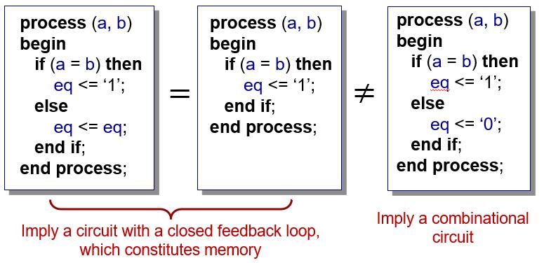

Incomplete signal assignment
^^^^^^^^^^^^^^^^^^^^^^^^^^^^^
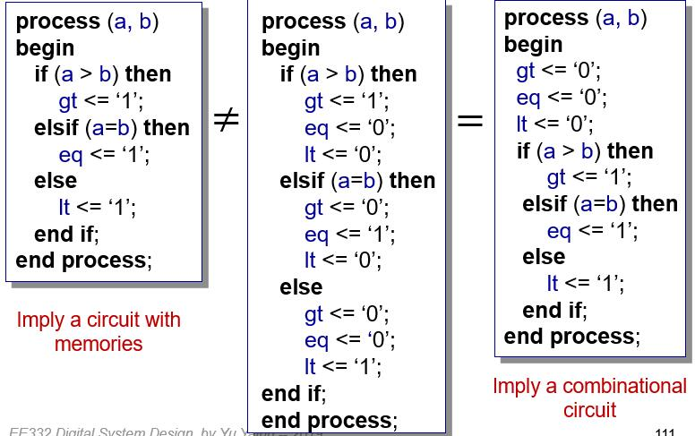
   
case statement
++++++++++++++
* A case is a multiway branch based on the value ofstatement a control expression
* General form of a case statement

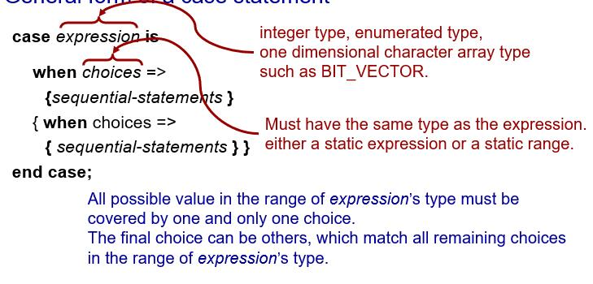

.. admonition:: Examples
    
    4-to-1 multiplexer based on a case statement
    
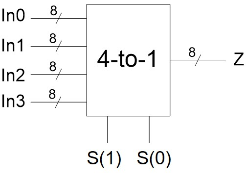
    
.. code::

    architecture case_arch of mux4 is
    begin
        process(In0, In1, In2, In3, S)
        begin
            case S is
                 when “00” =>
                    Z <= In0;
                 when “01” =>
                    Z <= In1;
                 when “10” =>
                    Z <= In2;
                 when others 
                    Z <= In3;
            end case;
        end process;
    end case_arch;

.. admonition:: Examples
    
    4-to-2 priority encoder based on a case statement
    

    
.. code::
    
    architecture case_arch of pr_encoder is
    begin
        process(S)
        begin
            case S is
                 when “1000” | “1001” | “1010” | “1011” |
                      “1100” | “1101” | “1110” | “1111”  =>
                    Z <= “11”;
                 when “0100” | “0101” | “0110” | “0111” =>
                    Z <= “10”;
                 when “0010” | “0011” =>
                    Z <= “01”;
                 when others 
                    Z <= “00”;
            end case;
        end process;
    end case_arch;

.. code-block::    
   :linenos:
   
    signal S1 : integer range 0 to 7;
    signal I1, I2, I3 : bit;
    select_process: process(S1, I1, I2, I3) is
    begin
    case S1 is
        when 0 | 2 => OU <= ‘0’ ;
        when 1 => OU <= I1;
        when 3 to 5 => OU <= I2;
        when others => OU <= I3;
    end case ;
    end process select_process;

.. admonition:: Examples

    A two-process half-adder model
    
.. code-block::    
   :linenos:

    library IEEE;
    use IEEE.std_logic_1164.all;
    entity half_adder is
    port (x, y : in std_logic; sum, carry : out std_logic);
    end entity half_adder;
    architecture behavior of half_adder is
    begin
        sum_proc: process (x, y) is -- this process computes the value of sum
        begin
            if (x=y) then sum <= ‘0’ after 5 ns; 
            else sum <= (x or y) after 5 ns;
            end if;
        end process sum_proc;
        carry_proc: process (x,y) is -- this process computes the value of carry
        begin
            case x is
                 when ‘0’ => carry <= x after 5 ns;
                 when ‘1’ => carry <= y after 5 ns;
                 when others => carry <= ‘X’ after 5 ns;
            end case;
        end process carry_proc;
    end architecture behavior;
    
null statement
++++++++++++++
The statement ``null;`` is a sequential statement that does not cause any action to take place;

.. code::
    variable SEL	: integer range 0 to 31;
    variable V 		: integer range 0 to 31;
    case SEL is
        when 0 to 15 => 	V := SEL;
        when others => 	null;
    end case;

More on process
---------------
* Upon initialization all processes are executed once, or suspended on some form of the wait statement reached.
* Thereafter, processes are executed in a data-driven manner: activated

    * by events on signals in the sensitivity list of the process or 
    * by waiting for the occurrence of specific event using the wait statement.

.. admonition:: Examples

    Signal assignment with process

.. code-block::    
   :linenos:

    library IEEE;
    use IEEE.std_logic_1164.all;
    entity sig_var is
    port (x, y, z : in std_logic; res1, res2 : out std_logic);
    end entity sig_var;
    architecture behavior of sig_var is
    signal sig_s1, sig_s2 : std_logic;
    begin
        proc1: process (x, y, z) is 
        variable var_s1, var_s2 : std_logic;
        begin
            L1: var_s1 := x and y; 
            L2: var_s2 := var_s1 xor z;
            L3: res1 <= var_s1 nand var_s2;
        end process proc1;
        proc2: process (x, y, z) is 
        begin
            L1: sig_s1 <= x and y;
            L2: sig_s2 <= sig_s1 xor z;
            L3: res2 <= sig_s1 nand sig_s2; 
        end process proc2;
    end architecture behavior;

* All of the ports of the entity and the signals declared within an architecture are visible within a process.
* These port and signals can be read or assigned values from within a process;  this is how processes can communicate among themselves.

.. admonition:: Examples

    Communicating processes

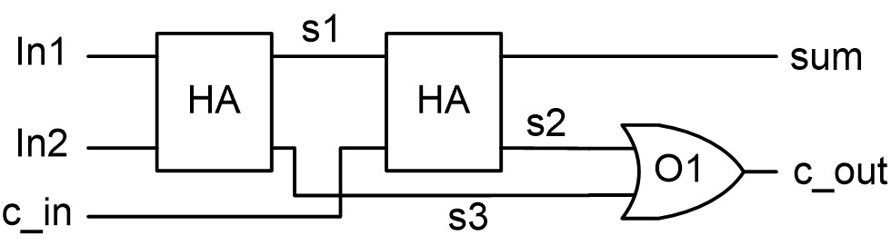
        
.. code-block::    
   :linenos:
   
    library IEEE
    use IEEE.std_logic_1164.all
    entity full_adder is
    port (In1, In2, c_in : in std_logic; 
            sum, c_cout : out std_logic);
    end entity full_adder;
        
    architecture behavioral of full_adder is
    signal s1, s2, s3 : std_logic;
    constant delay : time := 5 ns;
    begin
        HA1: process (In1, In2) is – process describing the first half adder
        begin
            s1 <= (In1 xor In2) after delay;
            s3 <= (In1 and In2) after delay;		
        end process HA1;
        HA2: process (s1, c_in) is – process describing the second half adder
        begin
            sum <= (s1 xor c_in) after delay;
            s2 <= (s1 and c_in) after delay;		
        end process HA2;
        OR1: process (s2, s3) is -- process describing the two-input OR gate
        begin
            c_out <= (s2 or s3) after delay;
        end process OR1;
    end architecture behavioral;