Modeling Structure
======================================

.. contents:: Table of Contents

* Describing a system in terms of the interconnections of its components.
* Motivation

    * represent a digital system in hierarchical structure.
    * share components between developers.

Component
---------    
**NAND2 Gate**

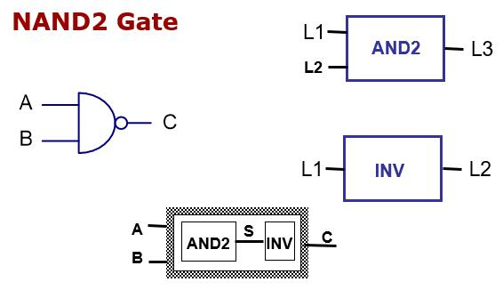
    
.. admonition:: Examples
    
    Architecture: Structure style

Component declaration: a component instance needs to be bound to an entity
    
.. code-block::    
   :linenos:
   
    entity NAND2 is
    port (A, B:    in  bit;     C     :    out  bit );
    end entity NAND2;

    architecture STRUCTURE  of  NAND2 is
        component AND2 is
             port (L1, L2 : in bit;
                      L3       : out bit);
        end component AND2;
        component INV is
             port (L1 : in bit;
             L2: out bit);
        end component INV;
        signal S : BIT;
    begin
        A1: AND2 port map (L1 => A,   			      L2 => B, L3 => S);
          A2: INV port map (L1=>S, L2=> C);
    end architecture STRUCTURE;

**Component instantiation**

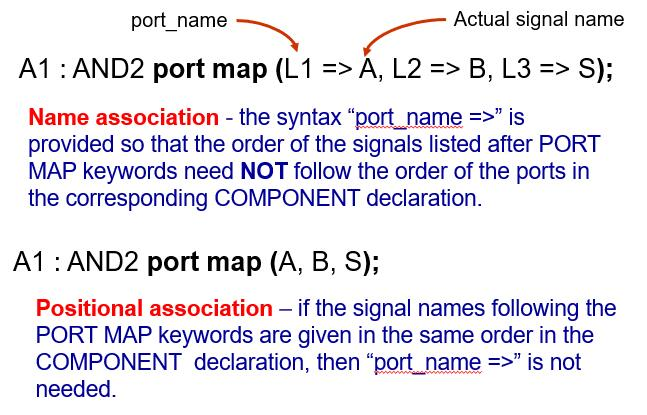
    
.. admonition:: Examples

    Component Entity: AND2 and INV    

.. code::
    
    entity AND2 is
    port (L1, L2   : in  bit;
             L3 : out  bit );
    end entity AND2;

    architecture dataflow  of AND2 is
    begin
         L3 <= L1 and L2;
    end architecture dataflow;

.. code::

    entity INV is
    port (L1 : in  bit;
             L2 : out  bit );
    end entity INV;

    architecture dataflow  of INV is
    begin
         L2 <= not L1;
    end architecture dataflow;

* Component Declaration

    * Defines the component’s interface.
    * In the declaration region of an architecture
    
* Component Instantiation

    * Only the external view of the component is visible.
    * Must be preceded by a label.
    * Name association and positional association.

.. admonition:: Examples
    
    Full Adder: Entity and architecture
   
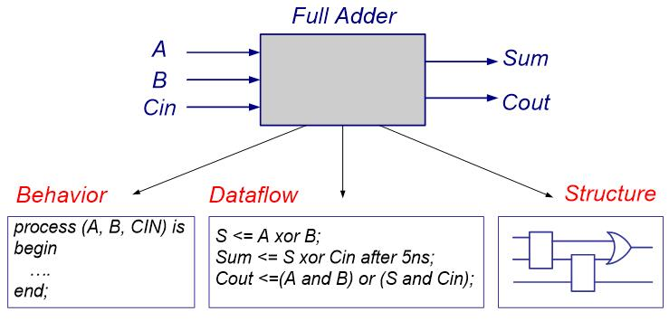

.. admonition:: Examples
    
    Full Adder: Data flow style architecture    

.. code::
        
    entity Full_Adder is
    port (A, B, Cin   : in  bit;
             Sum, Cout : out  bit );
    end entity Full_Adder;

    architecture DATAFLOW  of Full_Adder is
         signal S: bit;
    begin
         S <= A xor B;
         Sum <= S xor Cin after 5 ns;
         Cout <= (A and B) or (S and Cin); 
    end architecture DATAFLOW;

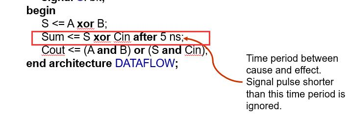

.. admonition:: Examples
    
    Full Adder: Behavioral style architecture
    
.. code::
    
    architecture behavioral of full_adder is
        signal s1, s2, s3 : std_logic;
        constant delay : time := 5 ns;
    begin
        HA1: process (In1, In2) is 
        begin
            s1 <= (In1 xor In2) after delay;
            s3 <= (In1 and In2) after delay;		end process HA1;
        HA2: process (s1, c_in) is 
        begin
            sum <= (s1 xor c_in) after delay;
            s2 <= (s1 and c_in) after delay;		end process HA2;
        OR1: process (s2, s3) is
        begin
            c_out <= (s2 or s3) after delay;
        end process OR1;
    end architecture behavioral;
 
.. admonition:: Examples

    Full Adder: structural style architecture

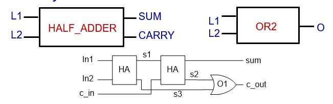
    
.. code::

    architecture STRUCTURE  of Full_Adder is
        component HALF_ADDER is
            port (L1, L2 : in bit;   SUM, CARRY : out bit);
        end component HALF_ADDER;
            component OR2 is
            port (L1, L2 : in bit;    O: out bit);
          end component OR2;
          signal N1, N2, N3 : BIT
    begin
         -- see next page;
    end architecture STRUCTURE;
    
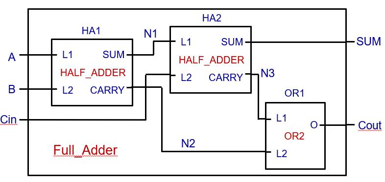

.. code::
    
    architecture STRUCTURE  of Full_Adder is
    begin
         HA1: HALF_ADDER port map (L1=>A, L2=>B, SUM=>N1, CARRY=>N2);
         HA2: HALF_ADDER port map (L1=>N1, L2=>CIN, SUM=>SUM, 
            CARRY=>N3);
         OR1: OR2       port map (L1=>N3, L2=>N2, O=>COUT);
     end architecture STRUCTURE;

.. admonition:: Examples

    Component Entity: Half_Adder

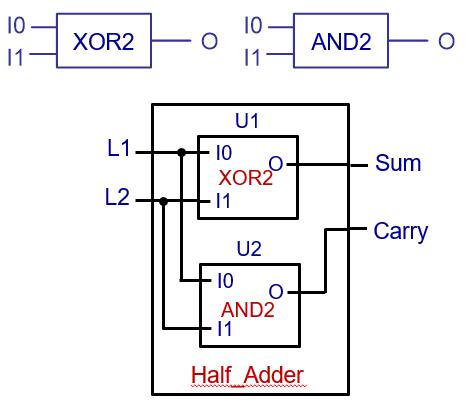
    
.. code::

    entity Half_Adder is
    port (L1, L2  : in  bit;
         Sum: out  bit;
         Carry: out bit );
    end entity Half_Adder;
    
.. code::

    architecture STRUCTURE  of Half_Adder is
        component XOR2 is
            port (I0, I1: in BIT; O: out bit);
         end component XOR2;
         component AND2 is
            port (I0, I1 : in BIT;  O: out bit);
         end component AND2;
    begin
         U1: XOR2 port map (I0 => L1, 
                    I1 => L2, O => Sum);
         U2: AND2 port map (I0 => L1, I1 => L2,               
                   O => Carry); 
    end architecture STRUCTURE;

.. admonition:: Examples
    
    Component Entity: OR2, AND2, XOR2

.. code::
    
    entity OR2 is
    port (L1, L2: in  bit; O: out  bit );
    end entity OR2;

    architecture BHV of OR2 is
    begin
         O <= L1 or L2 after 10 ns;
    end architecture BHV;

.. code::
    
    entity AND2 is
    port (I0, I1: in  bit; O: out  bit );
    end entity AND2;

    architecture dataflow of AND2 is
    begin
         O <= I0 and I1;
    end architecture dataflow;

.. code::
    
    entity XOR2 is
    port (I0, I1: in  bit;  O: out  bit );
    end entity XOR2;

    architecture BHV of XOR2 is
    begin
         O <= I0 xor I1 after 10 ns;
    end architecture BHV;

**Structural Decomposition: A design Hierarchy**

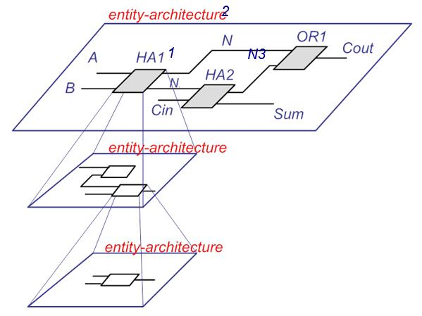

**Structural Decomposition: Design Tree**
    
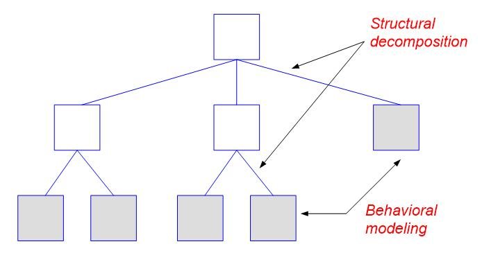
    
Configuration
-------------
When there is more than one architecture for an entity, configuration explicitly specifies which architecture is to be used for the entity during component instantiation.
    
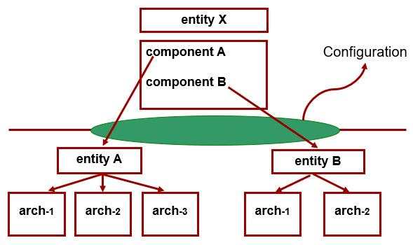
    
* The process of association of an architecture description with a component in a structure model is referred to as binding an architecture to a component.
* Default binding rules:

    * The entity with the same name as the component is bound to the component.
    * If there are multiple architectures for the entity, the last compiled architecture for the entity is used.
    * The entity-architecture description may locate in the same file as that of instantiating the component, or in some other files in the working directory. 

.. code-block::    
   :linenos:
   
    entity HALF_Adder is
    port (L1, L2  : in  bit;
             SUM, CARRY : out  bit );
    end entity Half_Adder;

    architecture STRUCTURE  of HALF_Adder is
         component XOR_GATE is
            port (I0, I1: in BIT; O : out BIT);
         end component XOR_GATE;
         component AND2 is
            port (I0, I1 : in BIT;  O  : out BIT);
         end component AND2;
    begin
         U1: XOR_GATE port map (L1, L2, SUM);
         U2: AND2 port map (L1, L2, CARRY); 
    end architecture STRUCTURE;

           architecture BEHAVIOR of HALF_ADDER is
           begin
        SUM <= L1 xor L2;
        CARRY <= L1 and L2;
           end architecture BEHAVIOR;

    architecture STRUCTURE  of Full_Adder is
        component HALF_ADDER is 
        port (L1, L2 : in bit;   SUM, CARRY : out bit);
        end component HALF_ADDER;
            component OR_GATE is
        port (L1, L2 : in bit;    O  : out bit);
            end component OR_GATE;
        for HA1: HALF_ADDER use entity HALF_ADDER(BEHAVIOR);
        for HA2: HALF_ADDER use entity HALF_ADDER(STRUCTURE);
            signal N1, N2, N3 : BIT;
    begin
          OR1: OR2 port map (L1=>N3, L2=>N2, O=>COUT);
        HA1: HALF_ADDER port map (L1=>A, L2=>B, SUM=>N1,CARRY=>N2);
           HA2: HALF_ADDER port map (L1=>N1, L2=>CIN, SUM=>SUM, 
            CARRY=>N3);
    end architecture STRUCTURE;

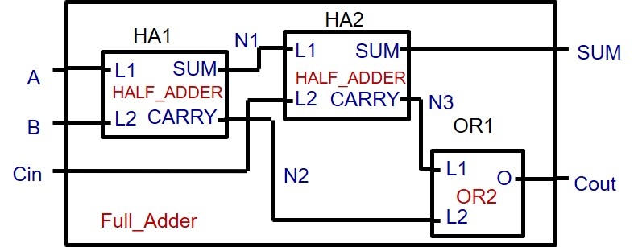

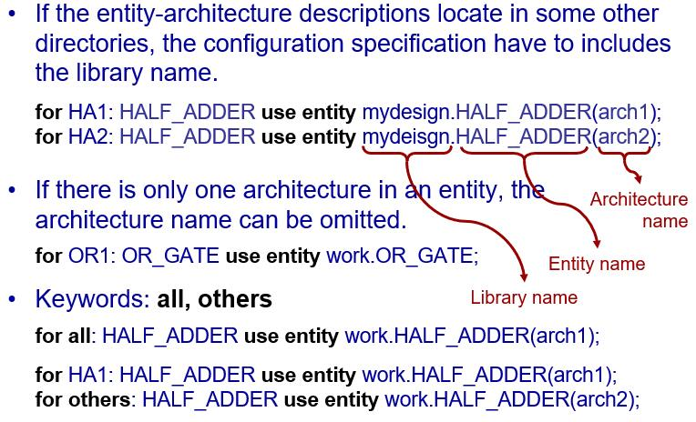

Modeling a test bench
---------------------
* Motivation

    * Test designs prior to construction and use of the circuit.
    
* To test a compiled VHDL design, we can either

    * provide stimuli interactively through the command window of a simulator, or
    * write a VHDL program (a VHDL test bench).  
    
* A test bench

    * does not have external ports.
    * contains two part:
    
        * a component representing the circuit under test
        * waveform generators which produce waveforms to the input of the component under test.
    
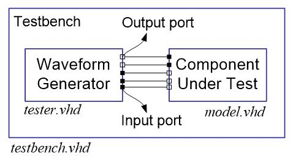

Functional verification of combinational designs
++++++++++++++++++++++++++++++++++++++++++++++++
* Determine if a design meets a system’s functional specifications.
* Not concern with any timing delays that results from mapping synthesized logic to a target programmable logic device.
* Allow to find logic errors early in the design flow and prevent wasting time performing synthesis, place and route, and time simulation.
    
**Language and approach to be used**

* Full range of VHDL language constructs and features can be used for test bench.
* Exhaustive verification 

    * Counting approach treating all inputs as a single vector starting from 0 and subsequently incremented through all its possible binary combinations.
    * Functionality approach taking into account the functionality of the design being tested when determining the order for applying input combination
    
A simple test bench
++++++++++++++++++++

.. code-block::    
   :linenos:
   
    library ieee;	-- load the ieee 1164 library
    use ieee.std_logic_1164.all;	-- make the package ‘visible’
                
    entity test_half_adder is   -- the top level entity of the test bench has no external ports. 
    end entity test_half_adder;

    architecture test of test_half_adder is
           component half_adder is -- declare the component under test
            port (x, y: in std_logic; sum, carry: out std_logic);
           end component half_adder;

           for UUT: half_adder use entity     -- configuration specifications             	
           work.half_adder(concurrent_beheavior);
           
    -- Stimulus signals – to connect test bench to UUT input ports
    signal x_tb, y_tb: std_logic;
    -- Observed signals – to connect test bench to UUT output ports
    signal sum_tb, carry_tb: std_logic;

    begin
        -- Create an instance of the half_adder circuit.
        UUT: half_adder port map (x =>x_tb, y => y_tb, sum =>
              sum_tb,  carry => carry_tb);

        -- Signal assignment statements generating stimulus values
        x_tb <= ‘1’, ‘0’ after 5 ns, ‘1’ after 10 ns, ‘0’ after 15 ns;
        y_tb <= ‘1’, ‘0’ after 10 ns;
    end architecture test;

**Waveforms from simulation of half-adder test bench**    

.. image:: ../_static/c5_Waveforms.jpg
    :align: center
    :width: 400   

Single process test bench
++++++++++++++++++++++++++

.. code-block::    
   :linenos:
   
    library ieee;	
    use ieee.std_logic_1164.all;
        
    entity test_half_adder is
    end entity test_half_adder;

    architecture behavior of test_half_adder is
           component half_adder is
            port (x, y: in std_logic; sum, carry: out std_logic);
           end component half_adder;
           for UUT: half_adder use entity                 		
           work.half_adder(concurrent_beheavior);

           signal x_tb, y_tb: std_logic;
           signal sum_tb, carry_tb: std_logic;
    begin
        UTT: half_adder port map (x =>x_tb, y => y_tb, sum => sum_tb, 	carry => carry_tb);

        -- define a process to apply input stimulus and verify outputs.
        tb: process is
            constant PERIOD: time := 20 ns;
        begin -- apply every possible input combination
            x_tb <= ‘0’; -- apply input combination 00 and check outputs
            y_tb <= ‘0’;
            wait for PERIOD;	-- Wait for outputs to be available after applying this stimulus
            assert ((sum_tb = ‘0’) and (carry_tb = ‘0’))
            report “Test failed for input combination 00” severity ERROR;
        x_tb <= ‘1’; -- apply input combination 10 and check outputs
        y_tb <= ‘0’;
        wait for PERIOD;
        assert ((sum_tb = ‘1’) and (carry_tb = ‘0’))
        report “Test failed for input combination 01” severity ERROR;

        x_tb <= ‘0’;
        y_tb <= ‘1’;
        wait for PERIOD;
        assert ((sum_tb = ‘1’) and (carry_tb = ‘0’))
        report “Test failed for input combination 10” severity ERROR;

        x_tb <= ‘1’;
        y_tb <= ‘1’;
        wait for PERIOD;
        assert ((sum_tb = ‘0’) and (carry_tb = ‘1’))
        report “Test failed for input combination 11” severity ERROR;

        wait; -- indefinitely suspend process
        end process;
    end architecture behavior;	

**Wait statement (Sequential statement)**

* explicitly specify the conditions under which a process may resume execution after being suspended.
* Basic forms of the wait statement ``wait for time-expression ;``,	``wait for 20 ns;``, ``wait on signal ;``,	``wait on clk, reset, status;`` , ``wait until condition ;``, ``wait until A > B;``, ``wait ;``

**Assert statement**

* VHDL’s assert statement provides a quick and easy way to check expected values and display messages from your test bench. An assert statement has the following general format:

.. code::

    assert condition_expression -- a Boolean value
    report text_string      	-- the text is displayed if the Boolean value is false
    severity severity_level;	-- severity level can be one of predefined levels: NOTE, WARNING, ERROR, or FAILURE.
    
Test benches that compute stimulus and expected results
+++++++++++++++++++++++++++++++++++++++++++++++++++++++

.. code::

	tb: process is -- define a process to apply input stimulus and verify outputs.
	     constant PERIOD: time := 20 ns;
	     constant n : integer := 2;
	begin -- apply every possible input combination
	     for i in 0 to 2**n - 1 loop
		(x_tb, y_tb) <= to_unsigned(i, n);	    
		wait for PERIOD;	
	    	assert ( (sum_tb = (x_tb xor y_tb)) and (carry_tb = (x_tb and y_tb)) )
	    	report “Test failed” severity ERROR;
	     end loop;
	     wait; 
	end process;

**Loop statement**

* A loop statement is used to iterate through a set of sequential statement. 
* General form of a loop statement

.. code::

    [ loop-label ] iteration-scheme loop
            sequential-statements 
    end loop [ loop-label ] 

**Three types of iteration schemes:**
    
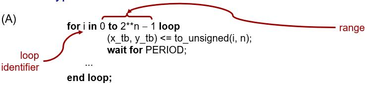

* The object i is implicitly declared within the for loop to belong to the integer type whose value are in the range 0 to 2n-1.
* The loop identifier cannot be assigned any value inside the for loop

.. code-block::
    :caption: A
        
    type COLOR is (RED, GREEN, BLUE);
    ...
    for PAPER in COLOR loop
        -- PAPER will take all value in type COLOR 
        -- from RED to BLUE.
    end loop;

.. code-block::
    :caption: B
    
    J := 0;  SUM := 10;
    WHILE_LOOP: while J < 20 loop
        SUM := SUM * 2;
        J := J +3;
    end loop WHILE_LOOP;

.. code-block::
    :caption: C
    
    J := 0;  SUM := 1;
    L2: loop
        J := J+21;
        SUM := SUM * 10;
        exit when SUM > 100;
    end loop L2;

**Exit statement**

* The exit statement can be used only inside a loop.
* It causes execution to jump out of the innermost loop or the loop whose label is specified. 
* General form of a exit statement ``exit [ loop-label ] [ when condition ]``

.. code::

    SUM := 1; 
    L2: loop 
        J := 0;  
        L3: loop
            J := J+21;
            exit when J > 40;
            SUM := SUM * 10;
            if SUM > 100 then exit L2;
            end if;
        end loop L3;
    end loop L2;

.. code::

    loop
         wait on A, B;
         exit when A=B;
    end loop;

**Next statement**

* The next statement can be used only inside a loop.
* It results in skipping the remaining statements in the current iteration; execution resumes with the first statement in the next iteration of this loop, if one exists. 
* General form of a next statement ``next [ loop-label ] [ when condition ]``

.. code::

    for J in 10 downto 5 loop
         if SUM < TOTAL_SUM then
        SUM := SUM + 2;
         elsif SUM = TOTAL_SUM then
            next;
         else 	null;
         end if;
         K := K + 1;
    end loop;

**signed and unsigned data type**

* In VHDL and the std_logic_1164 package, the arithmetic operations are defined only over the integer data type.

.. code::

	signal a, b, sum: integer;
	…
	sum <= a+b;

* Data types signed and unsigned are defined in IEEE numeric_std package.  Both data types are an array of element with the std_logic data type. They are interpreted as a signed number or unsigned number.
* std_logic_vector, signed, and unsigned are all defined as an array of elements with the std_logic data type, but they are three independent data types.
* To use the signed and unsigned data type, we must include:

.. code::

	library ieee;
	use ieee.std_logic_1164.all;
	use ieee.numeric_std.all;

	signal x, y: signed(15 downto 0);

**to_unsigned(i, n)**

* convert the integer i value to an unsigned vector of length n
* (x_tb, y_tb) <= to_unsigned(i, n);

    * the unsigned vector value returned in this example is assigned to an aggregate made up of the scalar input signals.
    * each of these scalar is type std_logic.
    * each element of an unsigned vector is also type std_logic.

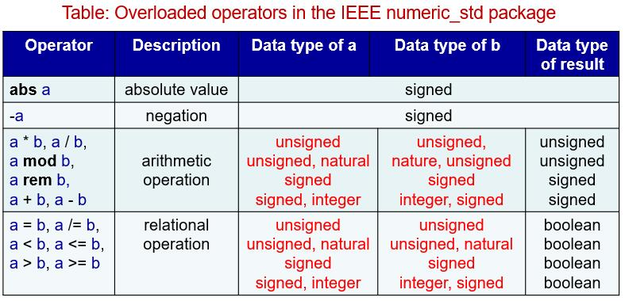
    
.. code::
    
    signal a, b, c, d, e: unsigned (7 downto 0);
    …
    a <= b + c;  	d <= b + 1;  	e <= (5 + a + b) - c;

    “011” >= “1000”;    -- return FALSE if type is std_logic_vector or unsigned
                        -- return TRUE if type is signed

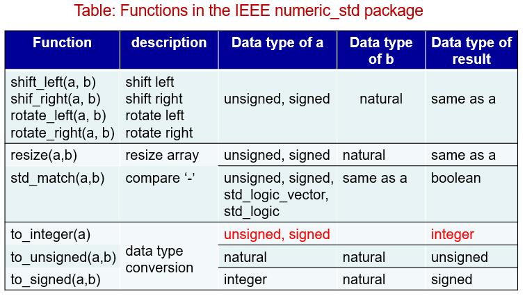

std_logic_vector, unsigned and signed are known as **closely related data types**.  Conversion between these types is done by a procedure known as **typing casting**.
	
    
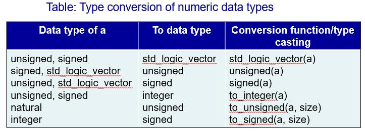

.. code::

    signal u1, u2: unsigned (7 downto 0);
    signal v1, v2: std_logic_vector(7 downto 0);
    …
    u1 <= unsigned(v1);  	
    v2 <= std_logic_vector(u2);

.. code::

    library ieee;
    use ieee.std_logic_1164.all
    use ieee.numeric_std.all
    …
    signal s1, s2, s3, s4, s5, s6: std_logic_vector (3 downto 0);
    signal u1, u2, u3, u4, u5, u6: unsigned(3 downto 0);
    signal sg: signed(3 downto 0);
    …
    u3 <= u2 + u1; -- ok
    u4 <= u2 + 1; -- ok
    u5 <= sg; -- not ok
    u6 <= 5; -- not ok
    u5 <= unsigned(sg); -- ok
    u6 <= to_unsigned(5,4); -- ok
    u7 <= sg + u1; -- not ok
    u7 <= unsigned(sg) + u1; -- ok

    s3 <= u3; -- not ok
    s4 <= 5; -- not ok
    s3 <= std_logic_vector(u3); -- ok
    s4 <= std_logic_vector(to_unsigned(5,4)); 	-- ok
    s5 <= s2 + s1; -- not ok
    s6 <= s2 + 1; -- not ok
    s5 <= std_logic_vector(unsigned(s2)  + 	unsigned(s1)); -- ok
    s6 <= std_logic_vector(unsigned(s2)  +  	1); -- ok

Post-synthesis and timing verifications for combinational designs
++++++++++++++++++++++++++++++++++++++++++++++++++++++++++++++++++++
* Post-synthesis verification 

    * to verify that the synthesizer has successfully translated a design description to gate-level logic.
    * the same test bench used for functional verification could be used.

* Timing verification

    * to verify gate delays and propagation delays of signal paths of the logic mapped to the target programmable logic device.
    * If the delay between application of each stimulus and verification of the corresponding UUT outputs was appropriately chosen in the original functional verification test bench, the same test bench could be used for timing verification.

    