Modeling at the RT level
======================================

.. contents:: Table of Contents

A register transfer level (RTL) design consists of a set of registers connected by combinational logic. 
    
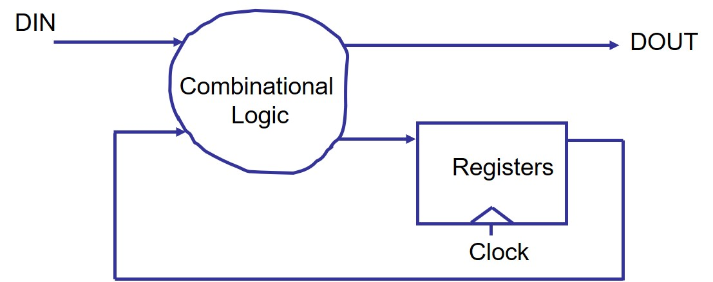

Combinational circuit    
---------------------
* A combinational circuit, by definition, is a circuit whose output, after the initial transient period, is a function of current input.
* It has no internal state and therefore is “memoryless” about the past event (or past inputs).
    
.. code::
    
    signal A, B, Cin, Cout : bit;
    …
    process (A, B, Cin) is
    begin
        Cout <= (A and B) or ((A xor B) and Cin); 
    end;

To describe a combinational circuit
++++++++++++++++++++++++++++++++++++
* The variables or signals in the process must not have initial values.
* A signal or a variable must be assigned a value before being referenced.
* The arithmetic operators (such as +, -, *, etc), relational operators (such as <, >, =, etc), and logic operators (such as and, or, not, etc) can be used in an expression.

Operator sharing
++++++++++++++++
One way to reduce the overall size of synthesized hardware is to identify the resources that can be used by different operations.  This is know as resource sharing.

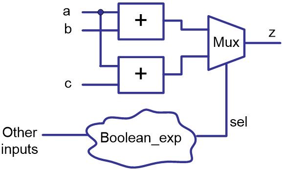
    
.. code::
        
    sel <= c1 xor c2;
    
    z <= a + b when sel=‘1’ else 
        a + c;
    
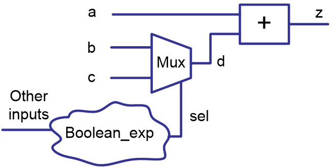

.. code::
    
    sel <= c1 xor c2;
    
    d <= b when sel=`1` else c; 
    z <= a + d;

* Performing resource sharing normally introduces some overhead and may penalize performance.
    
    * In the above examples, assume T  :sub:`adder`, T  :sub:`mux`, T :sub:`boolean`
    
    * For the circuit not sharing the adders: T = max ( T :sub:`adder`, T :sub:`boolean`) + T :sub:`mux`
    
    * For the circuit sharing the adders: T = T :sub:`adder + T :sub:`boolean` + T :sub:`mux` 

Shaping the circuit
+++++++++++++++++++
Using VHDL code, it is possible to outline the general shape of the circuit.

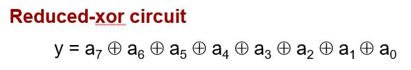

.. code::

    signal a: std_logic_vector (7 downto 0);
    signal y: std_logic;
    …
    y <= a(7) xor a(6) xor a(5) xor a(4) xor a(3) 
        xor a(2) xor a(1) xor a(0);

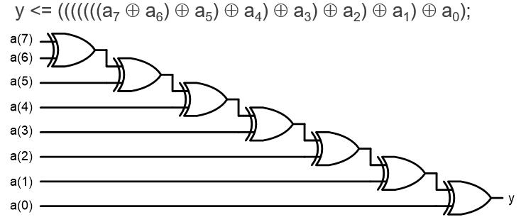

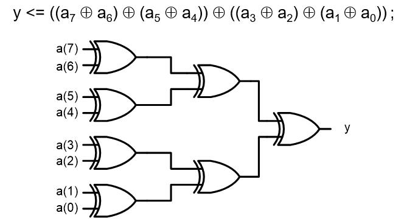

.. admonition:: Examples
    
    Combinational adder-based multiplier        
    
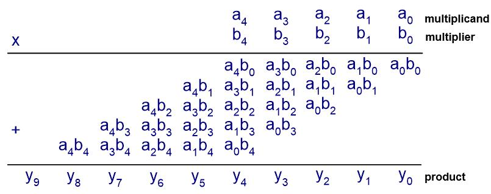
    
The algorithm includes three tasks:    
* Multiply the digits of the multiplier (b4, b3, b2, b1 and b0) by the multiplicand A = (a4, a3, a2, a1, a0) one at a time to obtain b4*A, b3*A, b2*A, b1*A and b0*A.  
        bi * A = (a4*bi, a3*bi, a2*bi, a1*bi, a0*bi)
* Shift bi * A to left by i position.
* Add the shifted bi * A terms to obtain the final product.
    
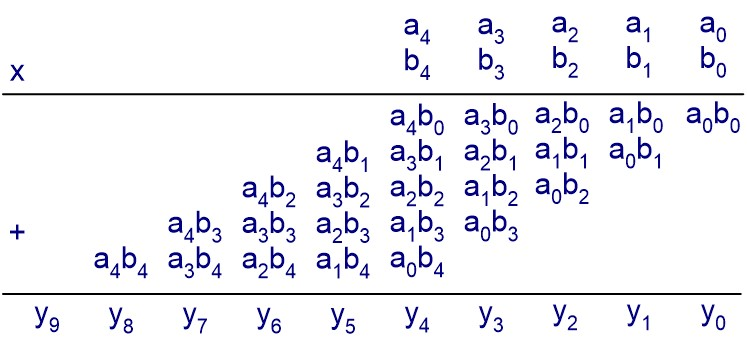

.. code-block::    
   :linenos:
       
    library IEEE;
    use ieee.std_logic_1164.all;
    use ieee.std_logic_arith.all;
    use ieee.std_logic_unsigned.all;
    entity mult5 is
    port (a, b : in std_logic_vector(4 downto 0);
           y: out std_logic_vector(9 downto 0));
    end entity mult5;
    architecture comb1_arch of mult5 is
    constant WIDTH : integer := 5; 
    signal au, bv0, bv1, bv2, bv3, bv4: std_logic_vector(WIDTH-1 downto 0);
    signal p0, p1, p2, p3, p4, prod: std_logic_vector(2*WIDTH-1 downto 0);

    begin
        au <= a;
        bv0 <= (others => b(0));
        bv1 <= (others => b(1));
        bv2 <= (others => b(2));
        bv3 <= (others => b(3));
        bv4 <= (others => b(4));
        p0 <= “00000” & (bv0 and au);
        p1 <= “0000” & (bv1 and au) & ‘0’;
        p2 <= “000” & (bv2 and au) & “00”;
        p3 <= “00” & (bv3 and au) & “000”;
        p4 <= ‘0’ & (bv4 and au) & “0000”;
        prod <= ((p0+p1)+(p2+p3))+p4;
        y <= prod;
    end architecture comb1_arch;

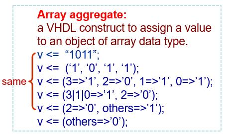

More efficient description of an adder-based multiplier

.. code-block::    
   :linenos:
   
    architecture comb2_arch of mult5 is
    constant WIDTH : integer := 5; 
    signal au, bv0, bv1, bv2, bv3, bv4: std_logic_vector (WIDTH-1 	downto 0);
    signal pp0, pp1, pp2, pp3, pp4: std_logic_vector (WIDTH downto 0);
    signal prod: std_logic_vector (2*WIDTH-1 downto 0);

    begin
        au <= a;
        bv0 <= (others => b(0));
        bv1 <= (others => b(1));
        bv2 <= (others => b(2));
        bv3 <= (others => b(3));
        bv4 <= (others => b(4));
        pp0 <= ‘0’ & (bv0 and au);
        pp1 <= (‘0’ & pp0(WIDTH downto 1))+ (‘0’ & (bv1 and au));
        pp2 <= (‘0’ & pp1(WIDTH downto 1))+ (‘0’ & (bv2 and au));
        pp3 <= (‘0’ & pp2(WIDTH downto 1))+ (‘0’ & (bv3 and au));
        pp4 <= (‘0’ & pp3(WIDTH downto 1))+ (‘0’ & (bv4 and au));
        prod <= pp4 & pp3(0) & pp2(0) & pp1(0) & pp0(0);
        y <= prod;
    end architecture comb2_arch;

Sequential circuit
------------------
* A sequential circuit is a circuit that has an internal state, or memory.
* Its output is a function of current input as well as the internal state. Thus the output is affected by current input values as well as past input values.
* A synchronous sequential circuit, in which all memory elements are controlled by a global synchronizing signal, greatly simplifies the design process and is the most important design methodology.
* Flip-flops and latches are two commonly used one-bit memory devices.
    
Latch
+++++
A latch is a level-sensitive memory device.

.. image:: ../_static/c6_latch.jpg
    :align: right
    :width: 200

.. code::

    signal S, d, q: bit
    ……
    process (S, d) is
    begin
         if (S=‘1’) then
            q <= d;
         end if;
    end process;

* In general, latches are synthesized from incompletely specified conditional expressions in a combinational description.
* Latch inferences occur normally with **if** statements or **case** statements.
* To avoid having a latch inferred, assign a value to the signal under all conditions.  

.. code::

    signal S, d, q: bit
    ……
    process (S, d) is
    begin
         if (S=‘1’) then q <= d;
         else q <= ‘0’;
         end if;
    end process;

asynchronous reset or preset
An asynchronous reset (or preset) will change the output of a latch to 0 (or 1) immediately.
    
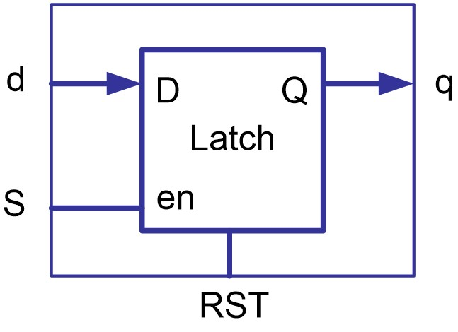
    
.. code::
    
    signal S, RST, d, q: bit
    ……
    process (S, RST, d) is
    begin
         if (RST = ‘1’) then
            q <= ‘0’;
         elsif (S=‘1’) then
            q <= d;
         end if;
    end process;

Flip-Flops (f/f)
++++++++++++++++
* A flip-flop is an edge-triggered memory device.
* To detect the rising edge (or falling edge), or the event occurred for a signal, we can make use of the attribute of a signal.
    
.. code::
    
    signal CLK : bit;
    ……
    CLK’event			true if CLK changes its value.
    CLK’event and CLK = ‘1’	true for the CLK rising edge
    CLK’event and CLK = ‘0’	true for the CLK falling edge
* The **event** attribute on a signal is the most commonly used edge-detecting mechanism.  It operates on a signal and  returns a Boolean value. The result is true if the signal shows a change in value.

.. admonition:: Examples

    a simple flip-flop
    
An edge triggered flip-flop will be generated from a VHDL description if a signal assignment is executed on the rising (or falling) edge of another signal.

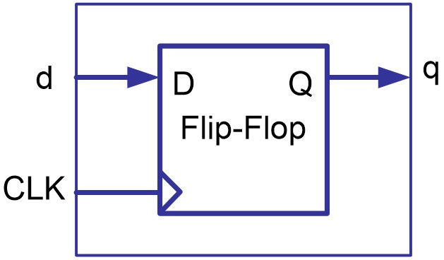

.. code::
  
    entity dff is
    port (d, CLK: in bit; q: out bit);
    end entity dff;
    architecture behavior of dff is
    begin
    process (CLK) is
    begin
         if (CLK’event and CLK=‘1’) then
            q <= d;
         end if;
    end process;
    end architecture behavior;

* Synchronous sets and resets
Synchronous inputs set (preset) or reset (clear) the output of flip-flops when they are asserted.  The assignment will only take effect while the clock edge is active.

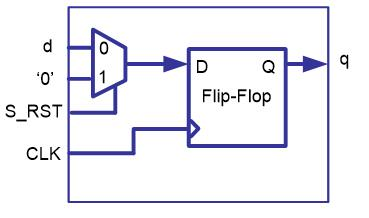
  
.. code::

    signal CLK, d, q, S_RST: bit;
    ……
    process (CLK) is
    begin
         if (CLK’event and CLK=‘1’) then
        if (S_RST = ‘1’) then
             q <= ‘0’;
        else
             q <= d;
        end if;
         end if;
    end process;

* Asynchronous sets and resets  
Asynchronous inputs set (preset) or reset (clear) the output of flip-flops whenever they are asserted independent of the clock.

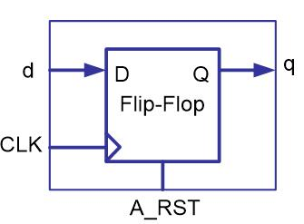
    
.. code::
    
    signal CLK , A_RST, d, q: bit;
    ……
    process (CLK, A_RST) is
    begin
         if (A_RST = ‘1’) then
            q <= ‘0’;
         elsif (CLK’event and CLK=‘1’) then
            q <= d;
         end if;
    end process;

* A f/f with more than one asynchronous input    

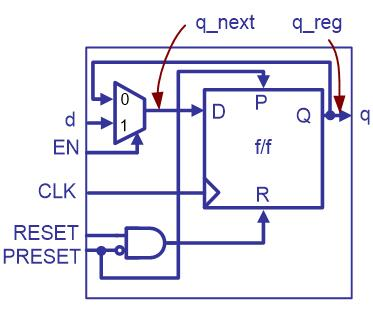

.. code-block::    
   :linenos:
   
    signal CLK , RST, PRST, EN: bit;
    signal d, q: bit;
    ……
    
    architecture two_seg of dff_en is
    signal q_reg, q_next : bit;
    begin
        process (CLK, PRST, RST) is
        begin
             if (PRST = ‘1’) then
                q_reg <= ‘1’;
             elsif (RST = ‘1’) then
                q_reg <= ‘0’;
             elsif (CLK’event and CLK=‘1’) then
                q_reg <= q_next;
             end if;
        end process;

        q_next <= d when EN = ‘1’ else
                q_reg;
        q <= q_reg;
    end architecture two_seg;

VHDL templates for sequential circuits
++++++++++++++++++++++++++++++++++++++
* An RTL circuit can be described in two segments:

    * A synchronous section updates the register information at the rising edge of the clock. ``q_reg <= q_next;``
    * A combinational section describes combinational logics, for example, update q_next;

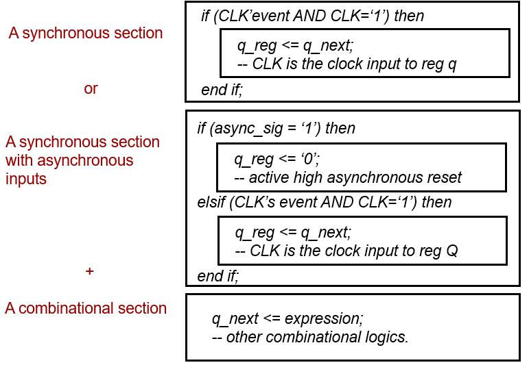
  
.. admonition:: Examples
    
    PULSER 

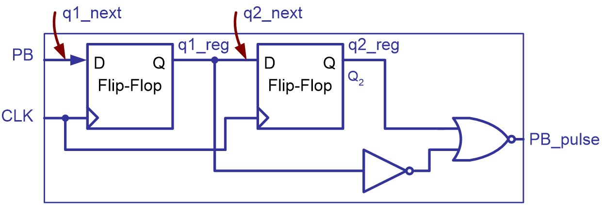
    
.. code-block::    
   :linenos:
   
    entity PULSER is
         port (CLK, PB : in bit ;
         PB_pulse : out bit);
    end PULSER;
    
    architecture BHV of PULSER is
         signal q1_reg, q2_reg, q1_next, q2_next : bit;
    begin
    process (CLK) is 
    begin
         if (CLK’event and CLK=‘1’) then
            q1_reg <= q1_next;
            q2_reg <= q2_next;
         end if;
    end process;
    q1_next <= PB;
    q2_next <= q1_reg;
    PB_pulse <= (not q1_reg) nor q2_reg;
    end architecture BHV;

Registers
++++++++++

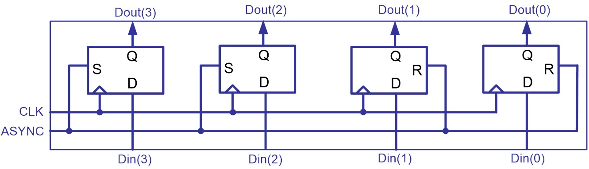
    
.. code::

    -- 4-bit simple register
    signal CLK , ASYNC : bit;
    singal Din, Dout : 
        bit_vector (3 down to 0);
    ……
    process (CLK, ASYNC) is
    begin
         if (ASYNC = ‘1’) then
            Dout <= “1100”;
         elsif (CLK’event and CLK=‘1’) then
        Dout <= Din;
         end if;
    end process;

.. admonition:: Examples

    4-bit serial-in and serial-out shift register

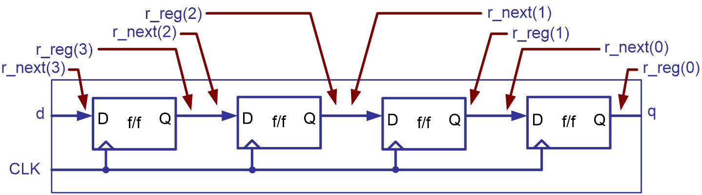
    
.. code::

    signal CLK ,d, q : bit;
    ……
    architecture two_seg of shift_register is 
    signal r_reg, r_next: bit_vector (3 downto 0);
    begin
    process (CLK) is
    begin
         if (CLK’event and CLK=‘1’) then
        r_reg <= r_next;
         end if;
    end process;

    r_next <= d & r_reg(3 downto 1); 
    q <= r_reg(0);
    end architecture two_seg;

Synchronous counter
+++++++++++++++++++

.. admonition:: Examples
    
    4-bit synchronous counter

.. code-block::    
   :linenos:
   
    library IEEE;
    use ieee.std_logic_1164.all;
    use ieee.std_logic_arith.all;
    use ieee.std_logic_unsigned.all;
    entity counter is
    port (CLK, RESET: in std_logic;
        load, Count, UpDown: in std_logic;
        DataIn: in std_logic_vector(3 downto 0);
        DataOut: out std_logic_vector(3 downto 0));
    end entity counter;
    architecture two-seg of counter is 
    signal Reg, Reg_Next : std_logic_vector (3 downto 0);

    begin
    process (CLK, RESET) is
    begin
    if RESET = ‘1’ then
         Reg <=”0000”;
    elsif CLK’event and CLK=‘1’ then
         Reg <= Reg_Next;
    end if;
    end process;
    -- next-state logic
    Reg_next <= DataIn when load = ‘1’ else
        (Reg+1) when (Count=‘1’ and UpDown = ‘1’) else
        (Reg-1) when (Count=‘1’ and UpDown =‘0’) else
        Reg;
    -- Output logic
    DataOut <= Reg;
    end architecture two-seg;

.. admonition:: Examples

    Decimal counter

* A decimal counter circulates the patterns in binary-coded decimal (BCD) format.
* The BCD code use 4 bits to represent a decimal number.
    
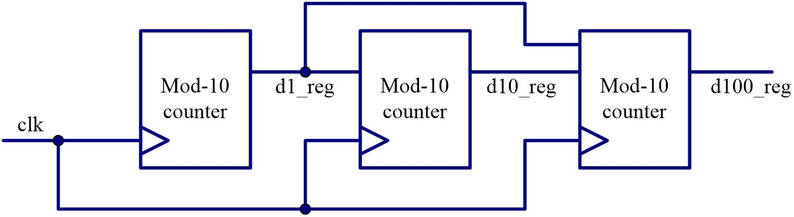

.. admonition:: Examples

    Three-digit decimal counter using conditional concurrent statements

.. code-block::    
   :linenos:
   
    library IEEE;
    use ieee.std_logic_1164.all;
    use ieee.std_logic_arith.all;
    use ieee.std_logic_unsigned.all;
    entity decimal_counter is
    port (CLK, RESET: in std_logic;
        d1, d10, d100: out std_logic_vector(3 downto 0));
    end entity decimal_ounter;
    architecture concurrent_arch of decimal_ounter is 
    signal d1_reg, d10_reg, d100_reg: std_logic_vector (3 downto 0);
    signal d1_next, d10_next, d100_next: std_logic_vector (3 downto 0);

    begin

    -- register 
    process (CLK, RESET) is
    begin
    if RESET = ‘1’ then
         d1_reg <=”0000”;
         d10_reg <=”0000”;
         d100_reg <=”0000”;
    elsif CLK’event and CLK=‘1’ then
         d1_reg <= d1_next;
         d10_reg <= d10_next;
         d100_reg <= d100_next;
    end if;
    end process;
    -- next-state logic
    d1_next <= “0000” when d1_reg = 9 else d1_reg+1;
    d10_next <= “0000” when (d1_reg = 9 and d10_reg = 9) else
            d10_reg+1 when d1_reg = 9 else d10_reg;
    d100_next <= “0000” when (d1_reg=9 and d10_reg=9 and d100_reg=9) else
            d100_reg+1 when (d1_reg=9 and d10_reg=9) else d100_reg;
    -- Output logic
    d1 <= d1_reg; d10 <= d10_reg; d100 <= d100_reg;
    end architecture concurrent_arch;

.. admonition:: Examples

    Three-digit decimal counter using a nested if statement

.. code-block::    
   :linenos:
   
    architecture if_arch of decimal_ounter is 
         signal d1_reg, d10_reg, d100_reg: std_logic_vector (3 downto 0);
         signal d1_next, d10_next, d100_next: std_logic_vector (3 downto 0);
    begin
    process (CLK, RESET) is
    begin
    if RESET = ‘1’ then
         d1_reg <=”0000”;
         d10_reg <=”0000”;
         d100_reg <=”0000”;
    elsif CLK’event and CLK=‘1’ then
         d1_reg <= d1_next;
         d10_reg <= d10_next;
         d100_reg <= d100_next;
    end if;
    end process;

    -- next-state logic
    process (d1_reg, d10_reg, d100_reg)
    begin
        d10_next <= d10_reg;
        d100_next <= d100_reg;
        if d1_reg /= 9 then
             d1_next = d1_reg+1;
        else -- reach 9
             d1_next = “0000”;
             if d10_reg /= 9 then
            d10_next <= d10_reg + 1;
             else -- reach 99
            d10_next <= “0000”;
            if d100_reg /= 9 then
                 d100_next <= d100_reg + 1;
            else -- reach 999
                 d100_next <= “0000”;
            end if;
             end if;
        end if;
    end process;
    -- Output logic
    d1 <= d1_reg; d10 <= d10_reg; d100 <= d100_reg;
    end architecture if_arch;
    
Netlist of RTL components
-------------------------
A data path usually consists of a netlist of RTL components such as function units, multiplexers, comparators, registers, etc.

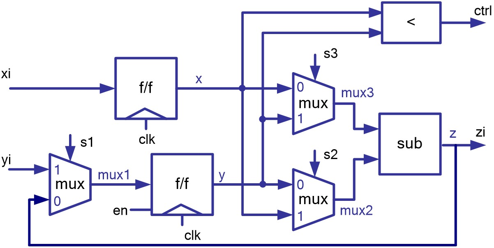

.. code-block::    
   :linenos:
   
    signal clk, en, s1, s2, s3 : std_logic;
    signal xi, yi, zi : std_logic_vector(7 downto 0);
    signal ctrl : boolean;
    ……
    architecture two_seg of datapath is
    signal x, y, z, x_next, y_next, mux1, mux2, mux3 : std_logic_vector (7 downto 0); 
    begin
    process (clk) is
    begin
    if reset =‘1’ then
        x <= “00000000”;
        y <= “00000000”; 
    elsif (clk’event and clk=‘1’) then -- registers
        x <= x_next;
        y <= y_next; 
    end if;
    end process;
    ctrl <= (x<y); -- comparator
    x_next <= xi;
    y_next <= mux1 when en = ‘1’ else y;

    mux1 <= z when s1 = ‘0’ else 
        yi; 	-- multiplexer
    mux2 <= y when s2 = ‘0’ else
         x; -- multiplexer 
    mux3 <= x when s3 = ‘0’ else
         y; 	-- multiplexer 
    z <= mux3 – mux2;  -- subtracter
    zi <= z;
    end architecture two_seg;

Test benches for sequential system
-----------------------------------
* All synchronous system require a system clock signal.
* A reset signal is required.  The reset signal is asserted at power on to place the sequential system in its initial state.

Generating a system clock
+++++++++++++++++++++++++

.. admonition:: Examples

    50% duty cycle clock

.. code::    

    clock_gen: process
	constant period : time := 100 ns;
	begin
		clk <= ‘0’;
		wait for period/2;
		clk <= ‘1’;
		wait for period/2;
	end process;

Generating the system reset
++++++++++++++++++++++++++++
* The reset signal typically

    * starts in its asserted state at power on,
    * remains in that state for a specified period of time, then
    * changes to its unasserted state, and
    * remains there for as long as power continues to be applied to the system.

* The duration of the assertion of the reset signal is specified as 

    * either a fixed time ``reset <= ‘1’, ‘0’ after 160 ns;``
    * or some multiple of the clock’s period and is synchronized to the system clock
	
.. code::
    
    reset_process : process
    begin
        reset <= ‘1’;
        for i in 1 to 2 loop
            wait until clk = ‘1’;
        end loop;
        reset <= ‘0’;
        wait;
    end process;

Synchronizing stimulus generation and monitoring
++++++++++++++++++++++++++++++++++++++++++++++++

.. code-block::    
   :linenos:
   
    monitor : process
        constant n : integer := 1000;
        variable number : integer range 0 to 999 :=0;
    begin
        wait until reset <= ‘0’;
        wait for 1 ns;
        for i in 0 to n loop
            number := to_integer(unsigned(d100))*100+to_integer(unsigned(d10))*10
                + to_integer(unsigned(d1));
            assert number = i mod n
            report “count of ” & integer’image(i mod n) & “ failed”
            severity error;
            wait until clk = ‘1’;
            wait for 1 ns;
        end loop;
        wait;
    end process;

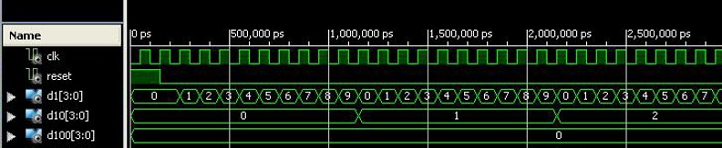

.. code::
        
    use ieee.numeric_std.all;
    signal x : std_logic_vector(3 downto 0); -- vector with element std_logic
    signal y : unsigned(3 downto 0); -- vector with element std_logic
    signal z : integer range 0 to 15;
    --conversion between std_logic_vector, signed, unsigned
    x <= y;  -- illegal assignment, type conflict
    y <= x;  -- illegal assignment, type conflict
    x <= std_logic_vector(y); -- legal assignment
    y <= unsigned(x);  -- legal assignment
    --conversion between signed, unsigned, integer
    z <= to_integer(y); -- legal assignment
    z <= to_integer(unsigned(x)); -- legal assignment
    y <= to_unsigned(z, 4); -- legal assignment
    x <= std_logic_vector(to_unsigned(z, 4)); -- legal assignment
        
        