Modeling at the FSMD level
======================================

.. contents:: Table of Contents

* A digital design is conceptually divided into two parts – a controller and a datapath. 
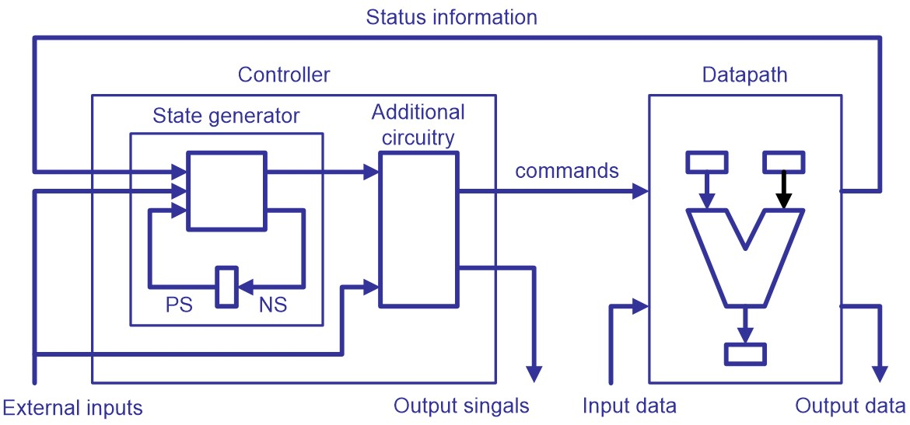
    
* A sequential circuit which is implemented in a fixed number of possible states is called a finite state machine (FSM). 

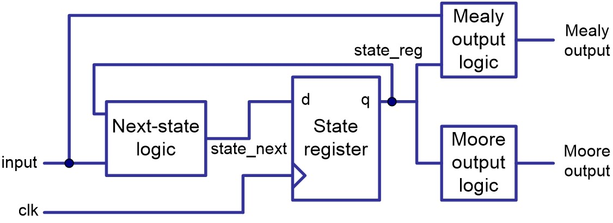
    
* It contains five elements:

    * symbolic state
    * input signal
    * output signal
    * present state
    * next state

* Two types of FSM:

    * Moore machines
    * Mealy machines

Moore machine
-------------
In the Moore modal of sequential circuits, the outputs are the functions of the present state only.

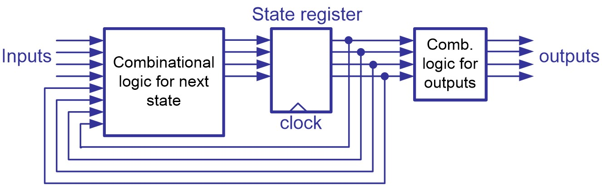

.. admonition:: Examples
    
    A state transition diagram of a Moore machine    

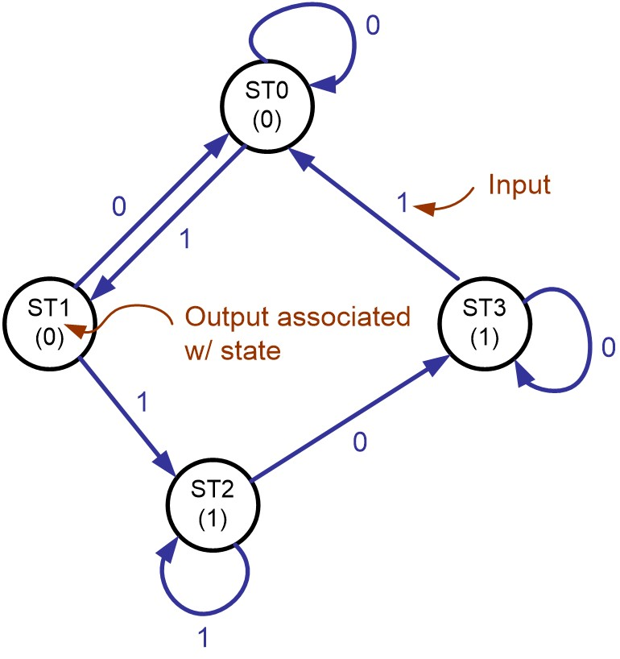

.. code-block::    
   :linenos:
   
    -- Moore machine
    entity MOORE is
    port (Clk, RST, I : in std_logic; 
            O : out std_logic);
    end entity MOORE;

    architecture two_seg_arch of MOORE is
    type state_type is (ST0, ST1, ST2, ST3);
    signal State, Next_State : 	state_type;
    begin
       clk_proc: process (CLK, RST) is
       begin
            if (RST = ‘1’) then
                State <= ST0;
            elsif (Clk’event and Clk = ‘1’) then
                State <= Next_State;
            end if;
       end process clk_proc;
       
       comb_proc: process (State, I) is
       begin
        case State is
           when ST0 =>
                O <= ‘0’ ; 
                if ( I =‘0’) then Next_State <= ST0;
                else Next_State <= ST1;
                end if;
           when ST1 =>
                O <= ‘0’ ;
                 if ( I = ‘0’ ) then Next_state <= ST0;
                 else Next_State <= ST2;
                 end if;
           when ST2 =>
                O <= ‘1’ ; 
                if ( I =‘0’) then Next_State <= ST3;
                else Next_State <= ST2;
                end if;
           when ST3 =>
                O <= ‘1’ ;
                if ( I = ‘0’ ) then 
                    Next_state <= ST3;
                else		  
                    Next_State <= ST0;
            end if;
          end case; 
        end process comb_proc; 
    end architecture two_seg_arch;

Mealy machine
-------------
In the Mealy modal, the outputs are the functions of both the present state and current inputs.    

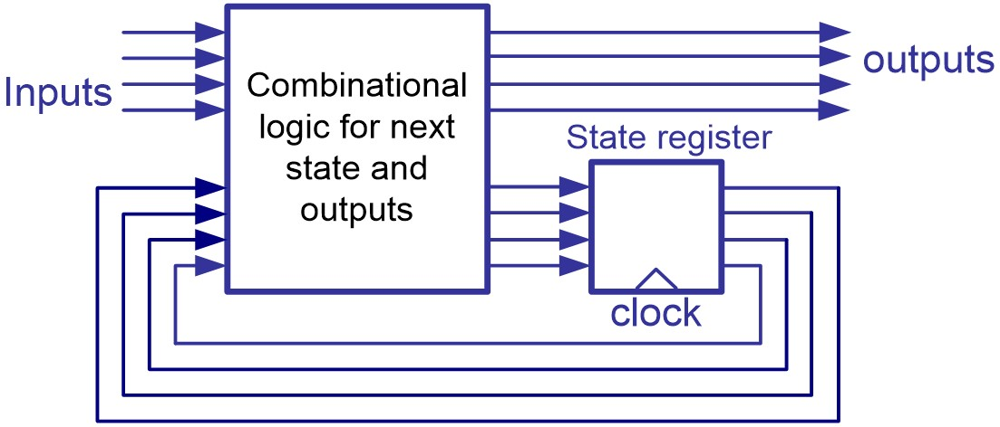

.. admonition:: Examples

    A state transition diagram of a Mealy machine
    
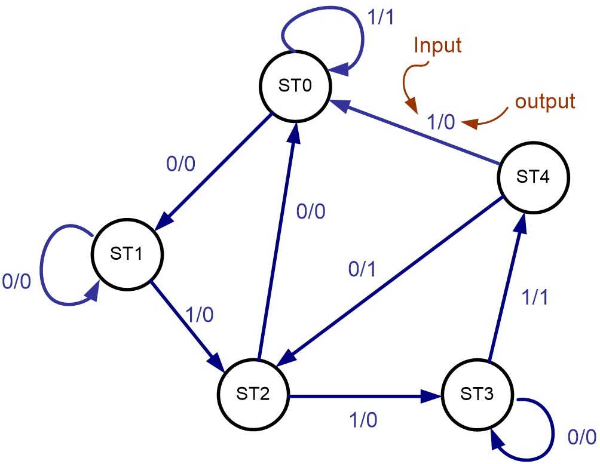
    
.. code-block::    
   :linenos:
   
    -- two segments coding style

    library IEEE;
    use IEEE.STD_LOGIC_1164.all

    entity MEALY is
    port (Clk, RST, I : in std_logic; 
            O : out std_logic);
    end entity MEALY;
    architecture two_seg_arch of MEALY is
    type state_type is (ST0, ST1, ST2, ST3, ST4);
    signal State, Next_State : 	state_type;
    begin
       clk_proc: process (CLK, RST) is
       begin
             if (RST = ‘1’) then
            State <= ST0;
            elsif (Clk’event and Clk = ‘1’) then
            State <= Next_State;
            end if;
       end process clk_proc;

    comb_proc: process (State, I) is
    begin
    case State is
       when ST0 =>
           if ( I =‘0’) then 
        O <= ‘0’ ; 
        Next_State <= ST1;
           else		
        O <= ‘1’;		
        Next_State <= ST0;
           end if;
       when ST1 =>
           if ( I =‘0’) then 
        O <= ‘0’ ; 
        Next_State <= ST1;
           else		
        O <= ‘0’;		
        Next_State <= ST2;
           end if;

       when ST2 =>
           if ( I =‘0’) then O <= ‘0’; Next_State <= ST0;
           else O <= ‘0’;	  
           Next_State <= ST3;
           end if;
       when ST3 =>
           if ( I =‘0’) then O <= ‘0’; Next_State <= ST3;
           else O <= ‘1’;	  
           Next_State <= ST4;
           end if;
       when ST4 =>
           if ( I =‘0’) then O <= ‘1’ ;Next_State <= ST2;
           else O <= ‘0’;	  
           Next_State <= ST0;
           end if;
    end case; 
    end process comb_proc; 
    end architecture two_seg_arch;

An FSM with a datapath (FSMD)
-----------------------------
* A traditional FSM 

    * cannot represent storage elements (register) except the state registers.  
    * works well for a design with a few to several hundred states.
* An FSM with a datapath (FSMD) is an extension of a traditional FSM.

    * storage and signals can be declared.
    * Within a state expression, comparison, arithmetic or logic operations on these signals can be performed.
       
* Algorithm state machine (ASM) chart

    * The behavior of a FSMD can be represented as a flow-chart-like description – algorithm state machine (ASM) chart.
    * ASM chart is constructed from ASM blocks;
    * An ASM block consists of three basic elements:
    
        * the state box
        * the decision box
        * the conditional output box.

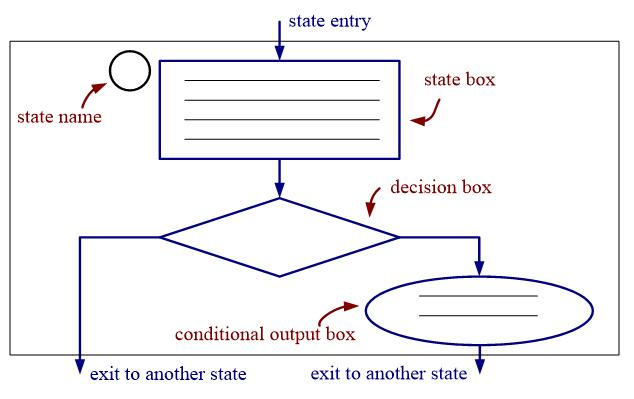
    
.. admonition:: Examples

    find the greatest common divisor of two eight-bit numbers xi and yi

.. code::
    
	x = xi;
	y= yi;
    St1: 	
    If x=y then 
	      ou=x;
	Else { 
	      if x> y then x = x-y;
	      Else y= y-x;
	      Go to st1;
	}
    
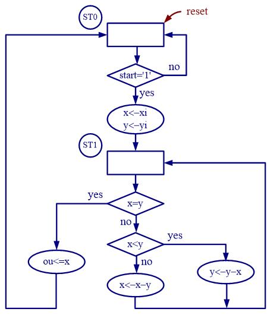
    
.. admonition:: Examples
    
    GCD calculator
    
.. code-block::    
   :linenos:
   
    -- GCD calculator

    library IEEE;
    use IEEE.STD_LOGIC_1164.ALL;
    use IEEE.STD_LOGIC_ARITH.ALL;
    use IEEE.STD_LOGIC_UNSIGNED.ALL;

    entity GCD is
        Port ( xi, yi : in  std_logic_vector(7 downto 0);
            clk, reset, start : in  std_logic;
            ou : out  std_logic_vector (7 downto 0));
    end entity GCD;

    architecture FSMD of GCD is
        signal x, y, x_next, y_next: std_logic_vector(7 downto 0);
        type S_Type is (ST0, ST1);
        signal state, next_state : S_Type;
            

    begin
      clkproc: process (clk, reset) is
         begin
             if (reset = ‘1’) then 
            state <= ST0;
            x <= 0; 
            y <= 0;
             elsif (clk’event and clk = ‘1’) then 
            state <= next_state;
            x <= x_next;
            y <= y_next;
            end if;
        end process clkproc;

      operproc: process (state, xi, yi, x, y, start) is 
      begin
        ou <= (others => ‘0’); 	
        x_next <= x;
        y_next <= y;
        next_state <= ST0;
                
        case state is
            when ST0 => 
        if ( start =‘1’) then 
              x_next <= xi;
              y_next <= yi;
              next_state <= ST1; 
        end if; -- (start = ‘1’)
            when ST1 =>
        if ( x = y ) then
              ou <= x; 
        else
              if ( x < y) then
                y_next <= y – x;
              else -- ( x > y) 
                x_next <= x – y;
              end if; 
              next_state <= ST1;
        end if; 
        end case;  -- State
    end process operproc; 
    end architecture FSMD;

.. admonition:: Examples
    
    find the greatest common divisor of two eight-bit numbers xi and yi    
    
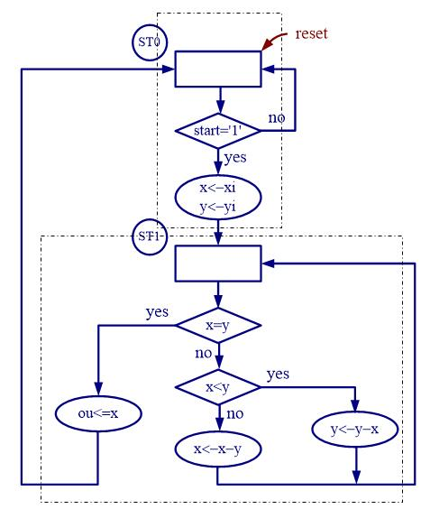

**Rules to Construct ASM Chart:**    

* For a given input combination, there is one unique exit path from the current AMS block.
* The exit path of an ASM block must always lead to a state box.  The state box can be the state box of the current ASM block or a state box of another ASM block.

**Common errors in ASM Chart Construction**

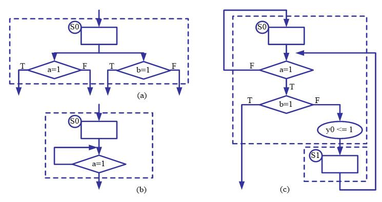

.. admonition:: Examples
    
    FSMD design of a repetitive-addition multiplier
    
Consider a multiplier with a_in and b_in, and with output r_out.  The repetitive-addition algorithm can be formalized in the following pseudo-code:

.. code::

    if (a_in =0 or b_in =0) then{
        r = 0;}
    else{
        a = a_in;	n = b_in;  r = 0;
        r = r + a;
        n = n - 1;
        if (n = 0) then {goto stop;}
        else {goto op;}
    }
    r_out = r;

* Step 1: Defining the input and output signals

    * Input signals:
    
        * a_in and b_in: input operands. 8-bit signals with std_logic_vector data type and interpreted as unsigned integers
        * start: command.  The multiplier starts operation when the start signal is activated.
        * clk: system clock;
        * reset: asynchronous reset signal for system initialization.
        
    * Output signals
    
        * r_out: the product.  16-bit signals.
        * ready: external status signal.  It is asserted when the multiplication circuit is idle and ready to accept new inputs.
    
* Step 2: Converting the algorithm to an ASM chart
    
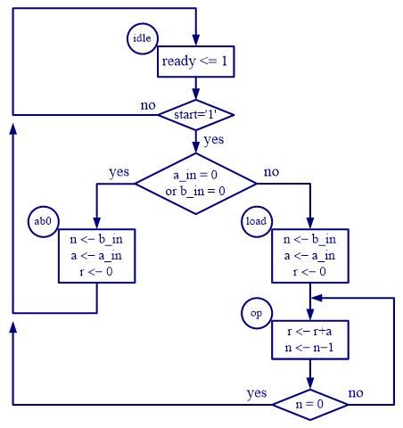
    
* Step 3: Constructing the FSMD    

    * Basic data path can be constructed as follows:
    
        * List all possible RT operations in the ASM chart.
        * Group RT operations according to their destination registers.
        * Derive the circuit for each group RT operation. 
        * Add the necessary circuits to generate the status signals.

    * 3.1 The circuit require 3 registers, to store signals r, n, and a respectively.
    * 3.2. The RT operations:
    
        * - RT operation with the r register:
        
            * r <- r ( in the idle state)
            * r <- 0 (in the load and ab0 state)
            * r <- r + a ( in the op state)
            
        * - RT operation with the n register:
        
            * n <- n ( in the idle state)
            * n <- b_in (in the load and ab0 state)
            * n <- n - 1 ( in the op state)
            
        * - RT operation with the a register:
        
            * a <- a ( in the idle and op state)
            * a <- a_in (in the load and ab0 state)

.. image:: ../_static/c7_chart6.jpg
    :align: center
    :width: 400        

    * 3.3  the conceptual diagram of the circuit associated with the r register
    
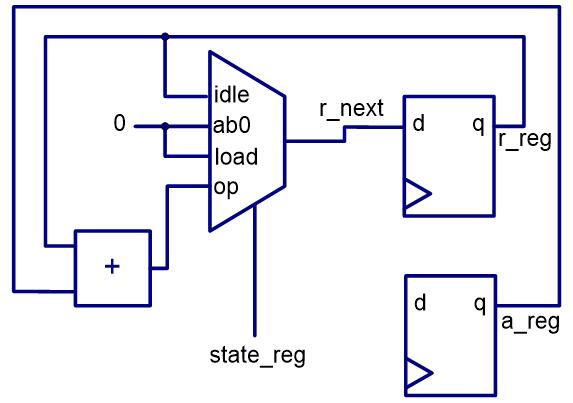

    * 3.4  Complete block diagram of a repetitive-addition multiplier.
    
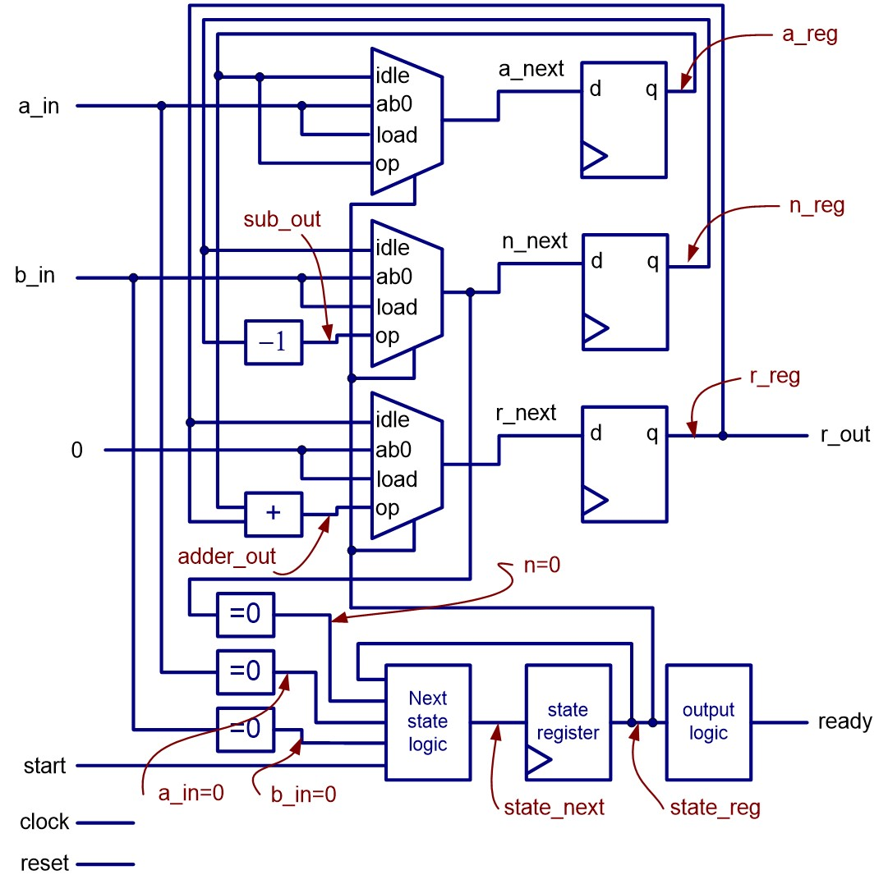
    
* Step 4: VHDL descriptions of FSMD    

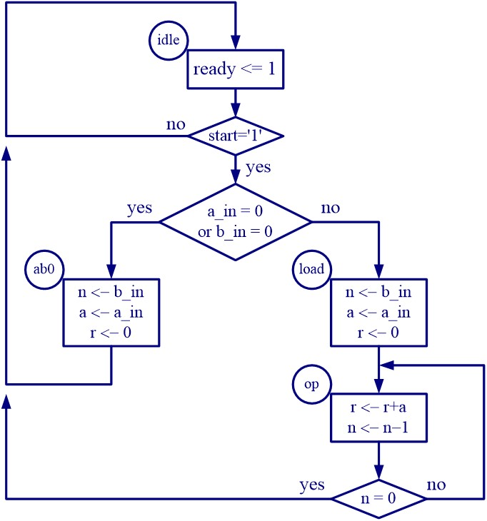
    
.. code-block::    
   :linenos:
   
    library IEEE;
    use ieee.std_logic_1164.all;
    use ieee.std_logic_arith.all;
    use ieee.std_logic_unsigned.all;
    entity seq_mult is
    port (CLK, RESET, start: in std_logic;
        a_in, b_in: in std_logic_vector(7 downto 0);
        ready: out std_logic;
        r: out std_logic_vector(15 downto 0));
    end entity seq_mult;
    architecture seg_arch of seq_mult is
    constant WIDTH : integer :=8;
    type state_type is (idle, ab0, load, op); 
    signal state_reg, state_next : state_type;
    signal a_reg, a_next, n_reg, n_next : std_logic_vector (WIDTH-1 downto 0);
    signal r_reg, r_next : std_logic_vector (2*WIDTH-1 downto 0);

    begin
    -- state and data registers 
    process (CLK, RESET) is
    begin
    if RESET = ‘1’ then
         state_reg <= idle;
         a_reg <= “00000000”;
         n_reg <=”00000000”;
         r_reg <= x” 0000”;
    elsif CLK’event and CLK=‘1’ then
         state_reg <= state_next;
         a_reg <= a_next;
         n_reg <= n_next;
         r_reg <= r_next;
    end if;
    end process;

    -- combinational circuit
    process (start, state_reg, a_reg, n_reg, 
        r_reg, a_in, b_in, n_next) is
    begin
        -- default value
        a_next <= a_reg;
        n_next <= n_reg;
        r_next <= r_reg;
        ready <= ‘0’;
        case state_reg is
             when idle =>
                  if start = ‘1’ then
            if (a_in = “00000000” or 
                              b_in = “00000000”) then
                 state_next <= ab0;
            else 
                 state_next <= load;
            end if;
                 else
            state_next <= idle;
                 end if;
                 ready <= ‘1’;
             
             when ab0 =>
                  a_next <= a_in;
                  n_next <= b_in;
                  r_next <= x“0000”;
                  state_next <= idle;
             when load =>
                  a_next <= a_in;
                  n_next <= b_in;
                  r_next <= x“0000”;
                  state_next <= op;
             when op =>
                  n_next <= n_reg - 1;
                  r_next <= (“00000000” & a_reg) 
                                     + r_reg;
                  if (n_next = “00000000” ) then
            state_next <= idle;
                  else
            state_next <= op;
                  end if ;
             end case;
        end process;
        r <= r_reg;
    end architecture seg_arch;

**Resource sharing via FSMD example of repetitive-addition multiplier**

* Many RT operations perform the same or similar function.
* Some function unit can be shared as long as these operations are scheduled in different states.
* the 16-bit adder and 8-bit decrementor are shared in the following example.

**Modified ASM chart**

    
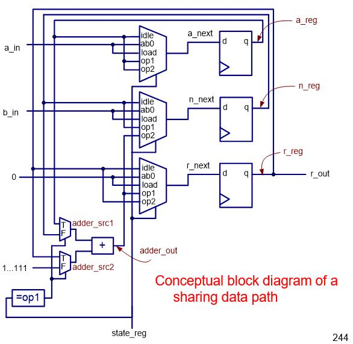

**sharing on a repetitive-addition multiplier**    

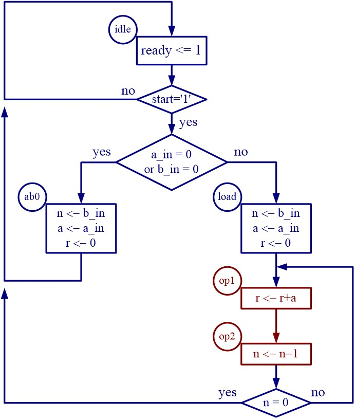

.. code-block::    
   :linenos:
   
    architecture sharing_arch of seq_mult is
    constant WIDTH : integer :=8;
    type state_type is (idle, ab0, load, op1, op2); 
    signal state_reg, state_next : state_type;
    signal a_reg, a_next, n_reg, n_next : std_logic_vector (WIDTH-1 downto 0);
    signal r_reg, r_next : std_logic_vector (2*WIDTH-1 downto 0);
    signal adder_scr1, adder_scr2: std_logic_vector (2*WIDTH-1 downto 0);
    signal adder_out: std_logic_vector (2*WIDTH-1 downto 0);

    begin
    -- state and data registers 
    process (CLK, RESET) is
    begin
    if RESET = ‘1’ then
         state_reg <= idle;
         a_reg <= “00000000”;
         n_reg <=”00000000”;
         r_reg <= x” 0000”;
    elsif CLK’event and CLK=‘1’ then
         state_reg <= state_next;
         a_reg <= a_next;
         n_reg <= a_next;
         r_reg <= a_next;
    end if;
    end process;

    -- next-state, logic/output logic and data path routing
    process (start, state_reg, a_reg, n_reg, r_reg, a_in, b_in, adder_out, n_next) is
    begin
        -- default value
        a_next <= a_reg;
        n_next <= n_reg;
        r_next <= r_reg;
        ready <= ‘0’;
        case state_reg is
             when idle =>
                  if start = ‘1’ then
            if (a_in = “00000000” or 
                              b_in = “00000000”) then
                 state_next <= ab0;
            else 
                 state_next <= load;
            end if;
                 else
            state_next <= idle;
                 end if;
                 ready <= ‘1’;
             
             when ab0 =>
                  a_next <= a_in;
                  n_next <= b_in;
                  r_next <= x“0000”;
                  state_next <= idle;
             when load =>
                  a_next <= a_in;
                  n_next <= b_in;
                  r_next <= x“0000”;
                  state_next <= op1;
             when op1 =>
                  r_next <= adder_out;
                  state_next <= op2;
             when op2 =>
                  n_next = adder_out (WIDTH -1 downto 0);
                  if (n_next = “00000000” ) then
            state_next <= idle;
                  else
            state_next <= op1;
                  end if ;
            end case;
           end process;

    -- datapath input routing and functional units
    process (state_reg, r_reg, a_reg, n_reg) is
    begin
        if (state_reg = op1) then
             adder_src1 <= r_reg;
             adder_src2 <= “00000000” & a_reg;
        else -- for op2 state
             adder_src1 <= “00000000” & n_reg;
             adder_src2 <= x“FFFF”;
        end if;
    end process;
    adder_out <= adder_src1 + adder_src2;
    -- output
    r <= r_reg;
    end architecture sharing_arch;
        