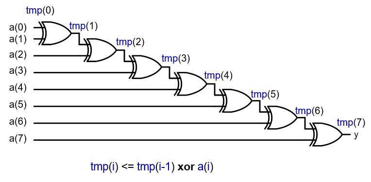
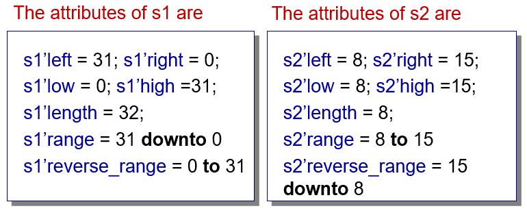
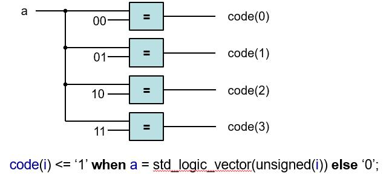
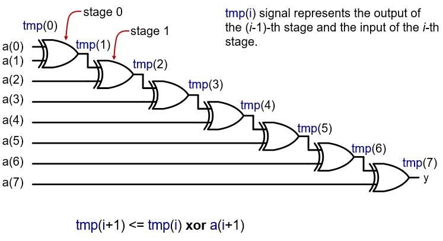
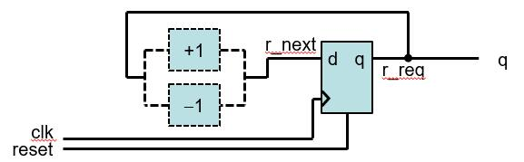
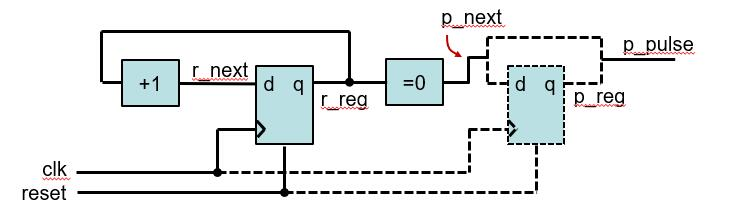

Parameterized Design
======================================

.. contents:: Table of Contents

* Goal: Design reuse

    * Ideally, we want to design some common modules that can be shared by many applications.
    * Since every application is different, it is desirable that a module can be customized to some degree to meet the specific need of an application.
    * Customization is normally specified by explicit or implicit parameters 

* Width Parameters

    * The widths of data signals normally can be modified to meet different requirement.
    * The width parameters of a parameterized design specify the sizes (i.e., number of bits) of the relevant data signal.

* Feature Parameters

    * Specify the structure or organization of a design.
    * Defined on an ad hoc basis.
    * To include or exclude certain functionalities (i.e., features) from implementation or to select one particular version of the implementation

Generics
---------
* The generic construct of VHDL is a mechanism to pass information into an entity and a component.

    * They are first declared in entity and component declaration and later assigned a value during component instantiation

.. code::

    entity para_binary_counter is
        generic (WIDTH: natural);
        port (
           clk, reset: in  std_logic;
          q: out  std_logic_vector(WIDTH-1 downto 0)
        );
    end entity para_binary_counter;

* After the declaration, the generic can be used in the associated architecture bodies.
* A generic cannot be modified inside the architecture body and thus functions like a constant

    * It is sometimes referred to as a generic constant.
       
.. code::

    architecture arch of para_binary_counter is 
        signal reg, reg_next : std_logic_vector (WIDTH-1 downto 0);
    begin
        process (clk, reset) is
        begin
              if reset = ‘1’ then
                reg <= (others =>’0’);
              elsif clk’event and clk=‘1’ then
            reg <= reg_next;
              end if;
        end process;
    -- next-state logic
        reg_next <= reg + 1;
        q <= std_logic_vector(reg);
    end architecture arch;

* To use the parameterized free-running binary counter in a hierarchical design, a similar component declaration should be included in the architecture declaration.
* The generic can then be assigned a value in the generic mapping section when a component instance is instantiated.
* Example of the use of generics 
  
.. code-block::    
   :linenos:
   
    library ieee;
    use ieee.std_logic_1164.all;
    entity generic_demo is
        port(
              clk, reset: in std_logic;
              q_4: out std_logic_vector(3 downto 0);
              q_12: out std_logic_vector(11 downto 0)
        );
    end entity generic_demo;

    architecture arch of generic_demo is
    component para_binary_counter is
              generic (WIDTH: natural);
              port (
            clk, reset: in  std_logic;
            q: out  std_logic_vector(WIDTH-1 downto 0)
              );
        end component para_binary_counter;

    begin
        four_bit: para_binary_counter
              generic map (WIDTH => 4)
              port map (clk => clk, reset => reset, q => q_4); 
        twelve_bit: para_binary_count
              generic map (WIDTH => 12)
              port map (clk => clk, reset => reset, q => q_12); 
    end architecture arch;

    
**Parameterized reduced-xor circuit using a generic** 

.. code-block::    
   :linenos:
   
    library ieee;  
    use ieee.std_logic_1164.all;
    entity reduced_xor is
        generic (WIDTH: natural); -- generic declaration
        port(
              a: in std_logic_vector(WIDTH-1 downto 0);
              y: out std_logic
        );
    end entity reduced_xor;

    architecture loop_linear_arch of reduced_xor is
        signal tmp: std_logic_vector(WIDTH-1 downto 0);
    begin
        process (a, tmp) is
        begin
              tmp(0) <= a(0); -- boundary bit
              for i in 1 to (WIDTH-1) loop
            tmp(i) <= a(i) xor tmp(i-1);
              end loop;
        end process;
        y <= tmp(WIDTH-1);
    end architecture loop_linear_arch;

Array attribute
---------------
* A VHDL **attribute** provides information about a named item, such as a data type or a signal. 
* We have used the **’event** attribute, as in **clk’event**, express the changing edge of the **clk** signal.
* A set of attributes is associated with an object of an **array** data type. Let **s** be a signal with an array data type.

    * s’left, s’right: the left and right bounds of the index range of s.
    * s’low, s’high: the lower and upper bounds of the index range of s.
    * s’length: the length of the index range of s.
    * s’range: the index range of s.
    * s’reverse_range: the reversed index range of s.
    

The attributes can be applied to the signal defined with std_logic_vector, unsigned and signed:

.. code::

	signal s1: std_logic_vector (31 downto 0);
	signal s2: std_logic_vector (8 to 15);

**Parameterized reduced-xor circuit using an attribute**
    
.. code-block::    
   :linenos:
   
    architecture loop_linear_arch of reduced_xor is
        signal tmp: std_logic_vector(a’length-1 downto 0);
    begin
        process (a, tmp) is
        begin
              tmp(0) <= a(0); 
              for i in 1 to (a’length-1) loop
            tmp(i) <= a(i) xor tmp(i-1);
              end loop;
        end process;
        y <= tmp(a’length-1);
    end architecture loop_linear_arch;

* The range of the for loop can also be expressed as:

    * for i in a’low+1 to a’high loop
    * for i in a’right+1 to a’left loop
    
* The last signal assignment ``y <= tmp (tmp’left);``

Unconstrained Array
--------------------
* Unconstrained array is defined as an array type with specified data type of the index value, but without specified exact bounds of the index value.
* Example: ``type  std_logic_vector is array (natural range <>) of std_logic``
* Similarly, we have **unsigned** and **signed** data types.
* If an object is declared with an unconstrained array data type, we must specify its index range when the data type is used, as 15 downto 0 in ``signal x: std_logic_vector(15 downto 0);``
* A special case: the unconstrained array can be declared without specifying the range in port declaration.
* Example: 

.. code-block::    
   :linenos:
   
    library ieee;  use ieee.std_logic_1164.all;
    entity unconstrain_dff is
        port( clk: std_logic;
                 d: in std_logic_vector;    	-- the actual range is inferred 
                 q: out std_logic_vector  	    -- when an instance of 
        );                                      -- unconstrain_dff is instantiated.
    end entity unconstrain_dff;

    architecture arch of unconstrain_dff is
    begin
        process (clk) is
        begin
              if (clk’event and clk=‘1’) then q <= d; end if;
        end process;
    end architecture arch;

* Since no range is specified for d and q, the boundaries of the two signal will not be check in the analysis stage. 

.. code-block::    
   :linenos:
       
    …
    signal din: std_logic_vector(15 downto 0);
    signal qout: std_logic(7 downto 0); -- syntactically correct.
    …                    -- error may be detected during the synthesis
    dff16: unconstrain_dff
        port map( clk => clk, d => din, q => qout);
    …

**Parameterized reduced-xor circuit using an unconstrained array**

**The code appears to be correct at first glance**

.. code-block::    
   :linenos:
   
    library ieee;  use ieee.std_logic_1164.all;
    entity unconstrain_reduced_xor is
        port(
              a: in std_logic_vector;
              y: out std_logic
        );
    end entity unconstrain_reduced_xor;

    architecture arch of unconstrain_reduced_xor is
        constant WIDTH: natural := a’length;
        signal tmp: std_logic_vector(WIDTH-1 downto 0);
    begin
        process (a, tmp) is
        begin
              tmp(0) <= a(0); 
              for i in 1 to (WIDTH-1) loop
            tmp(i) <= a(i) xor tmp(i-1);
              end loop;
        end process;
        y <= tmp(WIDTH-1);
    end architecture arch;

* If we map the a signal to an actual signal with the type of std_logic_vector of 8 bits during component instantiation, we may have a to be:
    
.. code::
    
    std_logic_vector(7 downto 0);
    std_logic_vector(0 to 7);
    std_logic_vector(15 downto 8);
    std_logic_vector(8 to 15);
    
* The code does not work properly for the last two formats.

**Improved parameterized reduced-xor circuit using an unconstrained array**

.. code-block::    
   :linenos:
   
    architecture better_arch of unconstrain_reduced_xor is
        constant WIDTH: natural := a’length;
        signal tmp: std_logic_vector(WIDTH-1 downto 0);
        signal aa: std_logic_vector(WIDTH-1 downto 0);
    begin
        aa <= a;
        process (aa, tmp) is
        begin
              tmp(0) <= aa(0); 
              for i in 1 to (WIDTH-1) loop
            tmp(i) <= aa(i) xor tmp(i-1);
              end loop;
        end process;
        y <= tmp(WIDTH-1);
    end architecture better_arch;

Comparison
-----------
* The **unconstrained array mechanism** uses attributes to infer the relevant information from the actual signal.

    * More general and flexible than the generic mechanism, but also
    * More opportunities for errors.
    * Requires comprehensive error-checking code
    
* **Generic mechanism** is preferred, unless a module is extremely general and widely used.

    * More rigid
    * It clearly specifies the range, direction and width of each signal and avoids many subtle erroneous conditions.

Generate Statement
------------------    
* The **generate statements** are concurrent statements with embedded internal concurrent statement, which can be interpreted as a circuit part. 
* Two types of generated statements:

    * **for generate statement**: used to create a circuit by replicating the hardware part
    * **conditional or if generate statement**: used to specify whether or not to create an optional hardware part.

For Generate Statement
++++++++++++++++++++++    
* Many digital circuits can be implemented as **a repetitive composition** of basic building blocks, exhibiting a regular structure, such as a one-dimensional cascading chain, a tree-shaped connection or a two-dimensional mesh.
* For generate statement syntax

.. code::
    
    gen_label: 	-- mandatory to identify to this    -- particular generate statement
	for loop_index in loop_range generate
	      concurrent statements; 				 -- describe a stage of the iterative circuit
	end generate;

* The loop_range has to be static. It is normally specified by the width parameters.

.. admonition:: Examples
    
    Binary decoder
    
* A binary n-to- 2 :sup:`n` decoder is circuit that asserts one of the 2 :sup:`n` possible output signal according to an n bit input signal.
* One way to view the binary decoder is to treat each bit of the decoded output as the result of a constant comparator.

**Parameterized binary decoder using a for generate statement**

.. code-block::    
   :linenos:
   
    library ieee;
    use ieee.std_logic_1164.all;
    use ieee.numeric_std.all;

    entity bin_decoder is
        generic(WIDTH: natural);
        port(
              a: in std_logic_vector(WIDTH-1 downto 0);
              code: out std_logic_vector(2**WIDTH-1 downto 0)
        );
    end bin_decoder;

    architecture gen_arch of bin_decoder is
    begin
        comp_gen:
        for i in 0 to (2**WIDTH-1) generate
              code(i) <= ‘1’ when i = to_integer(unsigned(a)) else
                       ‘0’; 
          end generate;
    end architecture gen_arch;
    

    
**Parameterized reduced-xor circuit using a for generate statement**

.. code::
    
    architecture gen_linear_arch of reduced_xor is
        signal tmp: std_logic_vector(WIDTH-1 downto 0);
    begin
        tmp(0) <= a(0);
        xor_gen:
              for i in 1 to (WIDTH-1) generate
            tmp(i) <= a(i) xor tmp(i-1);
              end generate;
         y <= tmp(WIDTH-1);
    end architecture gen_linear_arch;

* In an iterative structure, the boundary stages interface to the external input and output signals, and sometimes their connections are different from the regular blocks.

Conditional Generate Statement
++++++++++++++++++++++++++++++
* The conditional generate statement is used to specify an optional circuit that can be included or excluded in the final implementation.
* Conditional generate statement syntax

.. code::

	gen_label: 	-- mandatory
	if boolean_exp generate -- boolean_exp must be static
	      concurrent statements; 				
    end generate;
          
* There is no else branch in conditional generate statement.
* If we want to include one of the two possible circuits in an implementation, we must use two separate if generate statements.  

**Reduced-xor circuit revisited**

* One common use of the conditional generate statement is to describe the “irregular” stages in a for generate statement. 
* For example, two statements ``tmp(0) <= a(0);	y <= tmp(WIDTH-1);`` are used to rename the input and output signals in the for generate statement examples.
* To eliminate these statements, we can use conditional generate statements inside the for generate statement.

**Parameterized reduced-xor circuit with a conditional generate statement**

.. code-block::    
   :linenos:
   
    architecture gen_if_arch of reduced_xor is
        signal tmp: std_logic_vector(WIDTH-2 downto 1);
    begin
        xor_gen:
        for i in 1 to (WIDTH-1) generate
              -- leftmost stage
              left_gen: if i = 1 generate
            tmp(i) <= a(i) xor a(0);
              end generate;
              -- middle stage
              middle_gen: if (i>1) and (i<(WIDTH -1)) generate
                tmp(i) <= a(i) xor tmp(i-1);
              end generate;
              -- rightmost stage
              right_gen: if i = (WIDTH -1) generate
                y <= a(i) xor tmp(i-1);
              end generate;
        end generate;
    end architecture gen_if_arch;

.. admonition:: Examples

    Up-or-down free-running binary counter    
    
* An up-or-down binary counter is a counter that can be instantiated in a specific mode.
* Note that the “or” here means that only one mode of operation, either counting up or counting down but not both, can be implemented in the final circuit.

* We use the UP generic as the feature parameter to specify the desired mode.

**Up-or-down free-running binary counter**

.. code-block::    
   :linenos:

    library ieee;
    use ieee.std_logic_1164.all;
    use ieee.numeric_std.all;

    entity up_or_down_counter is
        generic(WIDTH: natural;  UP: natural);
        port(clk, reset: in std_logic;
              code: out std_logic_vector(WIDTH-1 downto 0)
        );
    end up_or_down_counter;

    architecture arch of up_or_down_counter is
        signal r_reg, r_next: unsigned(WIDTH-1 downto 0);
    begin
        -- register
        process (clk, reset)
        begin
              if (reset = ‘1’) then 
            r_reg <= (others => ‘0’)
              elsif (clk’event and clk=‘1’) then 
            r_reg <= r_next;
              end if;
        end process;
        
        -- next-state logic
        inc_gen: -- incrementor
        if UP = 1 generate  	
            r_next <= r_reg + 1;
        end generate;
        dec_gen: -- decrementor
        if UP /= 1 generate   
            r_next <= r_reg - 1;
        end generate;
        q <= std_logic_vector(r_reg);  -- output logic
    end architecture arch;

**Up-and-down free-running binary counter**

.. code-block::    
   :linenos:    

    library ieee;
    use ieee.std_logic_1164.all;
    use ieee.numeric_std.all;

    entity up_and_down_counter is
        generic map (WIDTH: natural)
        port map(clk, reset: in std_logic; mode: in std_logic;
              code: out std_logic_vector(2**WIDTH-1 downto 0)
        );
    end up_and_down_counterr;
        
    architecture arch of up_and_down_counter is
        signal r_reg, r_next: unsigned(WIDTH-1 downto 0);
    begin
        -- register
        process (clk, reset)
        begin
              if (reset = ‘1’) then 
            r_reg <= (others => ‘0’)
              elsif (clk’event and clk=‘1’) then 
            r_reg <= r_next;
              end if;
        end process;
        -- next-state logic
        r_next <= r_reg + 1 when mode =‘0’ else
                       r_reg -1;
        -- output logic
        q <= std_logic_vector(r_reg);  
    end architecture arch;

**Counter with an optional output buffer**
  
* An output buffer can remove glitches from the signal.
* Since the buffer is only needed for certain application, it will be convenient to include the buffer as an optional part of the circuit.  

**Counter with an optional output buffer**

.. code-block::    
   :linenos:

    library ieee;
    use ieee.std_logic_1164.all;
    use ieee.numeric_std.all;

    entity op_buf_counter is
        generic(WIDTH: natural; BUFF: natural);
        port(clk, reset: in std_logic;
              pulse: out std_logic);
    end op_buf_counterr;

    architecture arch of op_buf_counter is
        signal r_reg, r_next: unsigned(WIDTH-1 downto 0);
        signal p_reg, p_next: std_logic;
    begin
        -- register
        process (clk, reset)
        begin
              if (reset = ‘1’) then r_reg <= (others => ‘0’)
              elsif (clk’event and clk=‘1’) then r_reg <= r_next;
              end if;
        end process;
        
        -- next-state logic
        r_next <= r_reg + 1;
        -- output logic
        p_next <= ‘1’ when r_reg = 0 else ‘0’;
        buf_gen:
        if BUFF = 1 generate
              process (clk, reset)
              begin
            if (reset = ‘1’) then p_reg <= ‘0’
            elsif (clk’event and clk = ‘1’) then p_reg <= p_next;
                end if;
              end process;
              pulse <= p_reg;
        end generate;
        no_buf_gen: -- without buffer;
        if BUFF /= 1 generate
              pulse <= p_next;
        end generate;	
    end architecture arch;

Comparison
----------

* To create a circuit with a selectable feature:

    * use conditional generate statement
    * a full-featured circuit with some input control signal connected to constant values to permanently enable the desired feature
    * use the configuration construct 
    
* Assume we need a 16-bit up counter in a design.

.. code::

	count16up: up_or_down_counter
	      generic map (WIDTH => 16, UP =>1)
	      port map (clk => clk, reset => reset, q=>q);
	count16up: up_and_down_counter
 	      generic map (WIDTH => 16)
	      port map (clk => clk, reset => reset, mode => ‘1’, q=>q);
	
**Difference**

* The up-or-down counter instance

    * creates a circuit with only the needed features. 
    * The selected portion of code is passed to the synthesis stage, i.e., the synthesis software only needs to synthesize the selected portion.

* The up-and-down counter instance

    * creates a circuit that consists of all features and uses an external control signal to selectively enable a portion of the circuit.
    * The entire VHDL code is passed to synthesis stage. The synthesis software eliminates the unused portion through logic optimization.
* In general, use of the feature parameters and conditional generate statement is better than the full-featured approach.
* The selected hardware creation can also be achieved by configuration where multiple architecture bodies are constructed, each containing a specific feature, e.g., architectures up_arch and down_arch of the same entity updown_counter, for counting up and counting down, respectively.
* And the following instantiation can be used to select the counting up circuit.
	
.. code::

    count16up: work.updown_counter(up_arch)
	      generic map(WIDTH =>16)
	      port map (clk => clk, reset => reset, q => q);

**Up-or-down counter with two architecture bodies**

.. code-block::    
   :linenos:
   
    library ieee;
    use ieee.std_logic_1164.all;
    use ieee.numeric_std.all;

    entity updown_counter is
        generic(WIDTH: natural);
        port(clk, reset: in std_logic;
              q: out std_logic_vector(WIDTH-1 downto 0)
        );
    end updown_counter;

    architecture up_arch of updown_counter is
        signal r_reg, r_next: unsigned(WIDTH-1 downto 0);
    begin
        -- register
        process (clk, reset)
        begin
              if (reset = ‘1’) then r_reg <= (others => ‘0’)
              elsif (clk’event and clk=‘1’) then r_reg <= r_next;
              end if;
        end process;

        -- next-state logic
        r_next <= r_reg + 1;
        -- output logic
        q <= std_logic_vector(r_reg);
    end architecture up_arch;

    architecture down_arch of updown_counter is
        signal r_reg, r_next: unsigned(WIDTH-1 downto 0);
    begin
        -- register
        process (clk, reset)
        begin
              if (reset = ‘1’) then r_reg <= (others => ‘0’)
              elsif (clk’event and clk=‘1’) then r_reg <= r_next;
              end if;
        end process;
        -- next-state logic
        r_next <= r_reg - 1;
        -- output logic
        q <= std_logic_vector(r_reg);
    end architecture down_arch;

* Conversely, we can merge the logic from several architecture bodies into a single body and use a feature generic and conditional generate conditions to select the desired portion.
* There is no rule about when to use a feature parameter and when to use a configuration construct. In general,
  
    * code with a feature parameter is more difficult to develop and comprehend, but on the other hand, if we use a separate architecture body for each distinctive feature, the number of architecture bodies will grow exponentially and becomes difficult to manage.
    * when a feature parameter leads to significant modification or addition of the no-feature codes and starts to make the code incomprehensible, it is probably a good idea to use separate architecture bodies and the configuration construct.

For Loop Statement
-------------------
* The for loop statement is a sequential statement and is the only sequential loop construct that can be synthesized.

.. code::

	for index in loop_range loop    --loop_range must be static
	      sequential statements;
	end loop;
    
* The basic way to synthesize a for loop statement is to unroll or flatten the loop.  Unrolling a loop means to replace the loop structure by explicitly listing all iterations.

.. admonition:: Examples

    Binary decoder

**The code is very similar to the for generate version**

.. code::

    architecture loop_arch of bin_decoder is
    begin
        process (a)
        begin
              for i in 0 to (2**WIDTH-1) loop
    if i = to_integer(unsigned(a)) then code(i) <= ‘1’;
            else code(i) <= ‘0’;
            end if;
              end loop; 
          end process;
    end architecture gen_arch;

.. admonition:: Examples
          
    Reduced-xor circuit
    
For loop version:
For generate version:

.. admonition:: Examples

    Priority Encoder  
    
* Recall that a signal can be assigned with multiple times inside process and only the last assignment takes effect.
* A priority encoder is a circuit that returns the binary code of the highest-priority request.
* Assume that the input is an array of r(WIDTH-1 downto 0), and r(WIDTH-1) has the highest priority.

.. code-block::    
   :linenos:
       
    library ieee;
    use ieee.std_logic_1164.all;
    use ieee.numberic_std.all;
    use work.util_pkg.all;

    entity prio_encoder is
        generic(WIDTH: natural);
        port(r: in std_logic_vector(WIDTH-1 downto 0);
              bcode: out std_logic_vector(log2c(WIDTH)-1 downto 0);
              valid: out std_logic);
    end prio_encoder;

    architecture loop_linear_arch of prio_encoder is
        constant B: natural := log2c(WIDTH);
        signal tmp: std_logic_vector(WIDTH-1 downto 0);
    begin
        process (r) --binary code
        begin
              bcode <= (others => ‘0’);
              for i in 0 to (WIDTH-1) loop
            if r(i) = ‘1’ then
                  bcode <= std_logic_vector(to_unsigned(i, B));
            end if;
              end loop;
        end process;
        
        process(r, tmp) -- reduced – or circuit
        begin
              tmp(0) <= r(0);
              for i in 1 to (WIDTH – 1) loop
            tmp(i) <= r(i) or tmp(i-1);
                  end loop; 
          end process;
          valid <= tmp (WIDTH-1);
    end architecture loop_linear_arch;

Comparison
----------    
* Both the for generate and for loop statements are used to describe replicated structures.
* For generate statement: 

    * can only use concurrent statements.
    * start a design with a conceptual diagram of a few stages; the diagram is used to identify the basic building block and connection pattern, and then the code of the loop body is derived.

* For loop statement: 

    * can only use sequential statements.
    * the body of the loop statement can be more general and versatile.
    * may lead to unnecessarily complex implementation or even an unsynthesizable description.

