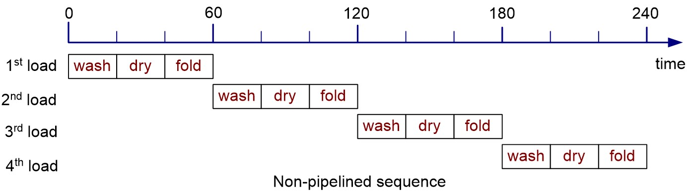
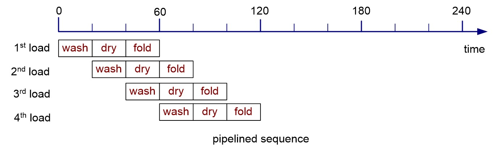
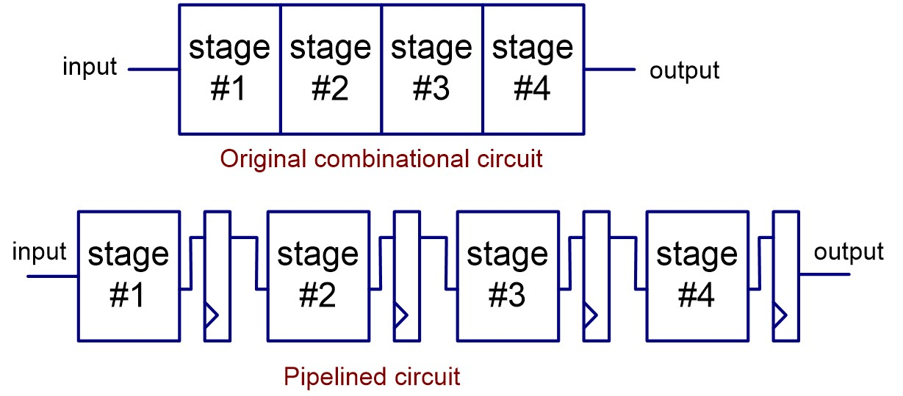
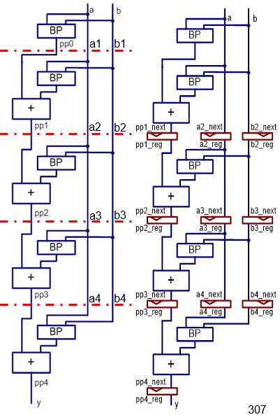
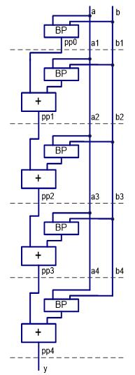
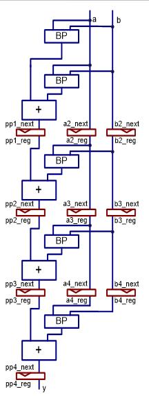

Pipelined design
======================================

.. contents:: Table of Contents

* Pipeline is an important technique to increase the performance of a system.
* The basic idea is to overlap the processing of several tasks so that more tasks can be completed in the same amount of time.        

Delay and throughput
--------------------
* Delay and throughput are the two criteria used to examine the performance of a system

    * Delay: the time required to complete one task.
    * Throughput: the number of tasks that can be completed per unit time. 
    
* Adding pipeline to a combinational circuit can increase the throughput but not reduce the delay.

Overview on pipelined design
-----------------------------
* The pipelining technique can be applied to a task that is processed in stages.

    * An example: Pipelined laundry.  
    * A complete laundry includes the stages of washing, drying and folding, for example. 

        
* For non-pipelined process, a new load cannot start until the previous load is completed. 

    * It takes 240 minutes to complete the four loads.
    * The delay of processing one load is 60 minutes.
    * The throughput is 1/60 load per minute.

* For pipelined process, 

    * It takes 120 minutes to complete the four loads.
    * The delay in processing one load remains 60 minutes.
    * The throughput increases to 2/60 load per minute.
    * To process k loads, it will take 40+20k minutes.
    * The throughput becomes k/(40+20k) load per minute  -> 1/20 load per minute when k is large.
        
**Pipelined combinational circuit**        

* A combinational circuit can be divided into stages so that the processing of different tasks can be overlapped.
* To ensure that the signals in each stage flow in the correct order and prevent any potential race, registers must be added between successive stages.
* The registers ensures that the signals can be passed to the next stage only at predetermined points.

    
Assume: propagation delay for each stage: T1, T2, T3 and T4. ``Tmax = max(T1, T2, T3, T4);``
Thus, the minimum clock period has to accommodate the longest delay plus the overhead introduced by the buffer register in each stage: ``Tc = Tmax + Tr;``

**The effectiveness of the circuit**

* Propagation delay:

    * non-pipelined circuit: T :sub:`comb` = T1+T2+T3+T4
    * pipelined circuit: Tpipe = 4Tc = 4Tmax + 4Tr
    
* Throughput:

    * non-pipelined circuit: 1/T :sub:`comb`; 
    * pipelined circuit: k/(3Tc+kTc) -> 1/Tc.  

**Ideally, for an N-stage circuit**

* The propagation delay of each stage is identical (i.e., Tmax = Tcomb/N)
* The register overhead (Tr) is comparably small

    * T :sub:`pipe` = NTc = NTmax = T :sub:`comb`
    * Throughput: 1/Tc = 1/Tmax = N/ T :sub:`comb`
    
* Ideally, it is desirable to have more stages in the pipeline. However, when N becomes large, 

    * the propagation delay of each stage becomes smaller, but Tr remains the same; its effect cannot be ignored.   
    * In reality, it is difficult to keep dividing the original combinational circuit into smaller and smaller stages.

Adding pipeline to a combinational circuit
-------------------------------------------
* The candidate circuits for effective pipeline design should include the following characteristics:

    * There is enough input data to feed the pipeline circuit.
    * The throughput is the main performance criterion.
    * The combinational circuit can be divided into stages with similar propagation delay.
    * The propagation delay of a stage is much longer than the delay incurred due to the register.

**The procedure to convert a combinational circuit to a pipelined design**

* Derive the block diagram of the original combinational circuit and arrange it as a cascading chain.
* Identify the major components and estimate the relative propagation delays of these components.
* Divide the chain into stages of similar propagation delays.
* identify the signals that cross the boundary of the chain.
* Insert registers for these signals in the boundary.

.. admonition:: Examples

    Simple pipelined adder-based multiplier    

.. image:: ../_static/c9_multiplier.jpg
    :align: center
    :width: 300     

**Non-pipelined multiplier in cascading stages**

 
.. code-block::    
   :linenos:
   
    library IEEE;
    use ieee.std_logic_1164.all;
    use ieee.std_logic_arith.all;
    use ieee.std_logic_unsigned.all;
    entity mult5 is
    port (clk, reset : in std_logic;
           a, b : in std_logic_vector(4 downto 0);
           y: out std_logic_vector(9 downto 0));
    end entity mult5;
    architecture comb_arch of mult5 is
    constant WIDTH : integer := 5; 
    signal a1, a2, a3, a4 : std_logic_vector (WIDTH-1 downto 0);
    signal b1, b2, b3, b4 : std_logic_vector (WIDTH-1 downto 0);
    signal bv0, bv1, bv2, bv3, bv4: std_logic_vector (WIDTH-1 downto 0);
    signal bp0, bp1, bp2, bp3, bp4: std_logic_vector (2*WIDTH-1 downto 0);
    signal pp0, pp1, pp2, pp3, pp4: std_logic_vector (2*WIDTH-1 downto 0);

    begin
        -- stage 0
        bv0 <= (others => b(0));
        bp0 <= “00000” & (bv0 and a);
        pp0 <= bp0;
        a1 <= a;
        b1 <= b;
        -- stage 1
        bv1 <= (others => b1(1));
        bp1 <= “0000” & (bv1 and a1) & “0”;
        pp1 <= pp0 + bp1;
        a2 <= a1;
        b2 <= b1;
        -- stage 2
        bv2 <= (others => b2(2));
        bp2 <= “000” & (bv2 and a2) & “00”;
        
        pp2 <= pp1 + bp2;
        a3 <= a2;
        b3 <= b2;
        -- stage 3
        bv3 <= (others => b3(3));
        bp3 <= “00” & (bv3 and a3) & “000”;
        pp3 <= pp2 + bp3;
        a4 <= a3;
        b4 <= b3;
        -- stage 4
        bv4 <= (others => b4(4));
        bp4 <= “0” & (bv4 and a4) & “0000”;
        pp4 <= pp3 + bp4;
        -- output
        y <= pp4;
    end architecture comb_arch;

Non-pipelined circuit:

.. code::

    -- stage 2
    pp2 <= pp1 + bp2;
    -- stage 3
    pp3 <= pp2 + bp3;

pipelined circuit:

    
.. code::

    -- register 
    if (reset = ‘1’) then
        pp2_reg <= (others => ‘0’);
        pp3_reg <= (others => ‘0’);
    elsif (clk’event and clk=‘1’) then
        pp2_reg <= pp2_next;
        pp3_reg <= pp3_next;
    end if;
    …
    -- stage 2
    pp2_next <= pp1_reg + bp2;
    -- stage 3
    pp3_next <= pp2_reg + bp3;

.. admonition:: Examples
    
    Pipelined multiplier

.. code-block::    
   :linenos:
       
    architecture pipe_arch of mult5 is
    constant WIDTH : integer := 5; 
    signal a2_reg, a3_reg, a4_reg, 
        b2_reg, b3_reg, b4_reg : 
        std_logic_vector (WIDTH-1 downto 0);
    signal a1, a2_next, a3_next, a4_next: 
        std_logic_vector (WIDTH-1 downto 0);
    signal b1, b2_next, b3_next, b4_next: 
        std_logic_vector (WIDTH-1 downto 0);
    signal bv0, bv1, bv2, bv3, bv4: 
        std_logic_vector (WIDTH-1 downto 0);
    signal bp0, bp1, bp2, bp3, bp4: 
        std_logic_vector (2*WIDTH-1 downto 0);
    signal pp1_reg, pp2_reg, pp3_reg, pp4_reg: 
        std_logic_vector (2*WIDTH-1 downto 0);
    signal pp0, pp1_next, pp2_next, pp3_next, pp4_next: 
        std_logic_vector (2*WIDTH-1 downto 0);

    begin
      -- pipeline registers 
      process (clk, reset)
      begin	
          if (reset = ‘1’) then
            pp1_reg <= (others => ‘0’);
            pp2_reg <= (others => ‘0’);
            pp3_reg <= (others => ‘0’);
            pp4_reg <= (others => ‘0’);
            a2_reg <= (others => ‘0’);
            a3_reg <= (others => ‘0’);
            a4_reg <= (others => ‘0’);
            b2_reg <= (others => ‘0’);
            b3_reg <= (others => ‘0’);
            b4_reg <= (others => ‘0’);
          elsif (clk’event and clk = ‘1’) then
            pp1_reg <= pp1_next;
            pp2_reg <= pp2_next;
            pp3_reg <= pp3_next;
            pp4_reg <= pp4_next;
            
            a2_reg <= a2_next;
            a3_reg <= a3_next;
            a4_reg <= a4_next;
            b2_reg <= b2_next;
            b3_reg <= b3_next;
            b4_reg <= b4_next;
           end if;
        end process;
           
        -- merged stage 0 & 1 for pipeline
        bv0 <= (others => b(0));
        bp0 <= “00000” & (bv0 and a);
        pp0 <= bp0;
        a1 <= a;
        b1 <= b;
        -- 
        bv1 <= (others => b1(1));
        bp1 <= “0000” & (bv1 and a1) & “0”;
        pp1_next <= pp0 + bp1;
        a2_next <= a1;
        b2_next <= b1;
        -- stage 2
        bv2 <= (others => b2_reg(2));
        bp2 <= “000” & (bv2 and a2_reg) & “00”;
        
        pp2_next <= pp1_reg + bp2;
        a3_next <= a2_reg;
        b3_next <= b2_reg;
        -- stage 3
        bv3 <= (others => b3_reg(3));
        bp3 <= “00” & (bv3 and a3_reg) & “000”;
        pp3_next <= pp2_reg + bp3;
        a4_next <= a3_reg;
        b4_next <= b3_reg;
        -- stage 4
        bv4 <= (others => b4_reg(4));
        bp4 <= “0” & (bv4 and a4_reg) & “0000”;
        pp4_next <= pp3_reg + bp4;
        -- output
        y <= pp4_reg;
    end architecture pipe_arch;
        
**More efficient Pipelined multiplier**

* Use a smaller (n+1)-bit adder to replace the 2n-bit adder in an n-bit multiplier.
* Reduce the size of the partial-product register
* Reduce the size of the registers that hold the b signal.

.. code-block::    
   :linenos:
           
    architecture efficient_pipe_arch of mult5 is
    signal a2_reg, a3_reg, a4_reg: std_logic_vector(WIDTH-1 downto 0);
    signal a1, a2_next, a3_next, a4_next:std_logic_vector(WIDTH-1 downto 0);
    signal b1: std_logic_vector(4 downto 1);
    signal b2_next, b2_reg: std_logic_vector (4 downto 2);
    signal b3_next, b3_reg: std_logic_vector (4 downto 3);
    signal b4_next, b4_reg: std_logic_vector (4 downto 4);
    signal bv0, bv1, bv2, bv3, bv4:
        std_logic_vector (4 downto 0);
    signal bp0, bp1, bp2, bp3, bp4: 
        std_logic_vector (5 downto 0);
    signal pp0: std_logic_vector  (5 downto 0);
    signal pp1_next, pp1_reg:std_logic_vector (6 downto 0);
    signal pp2_next, pp2_reg: std_logic_vector (7 downto 0);
    signal pp3_next, pp3_reg: std_logic_vector (8 downto 0);
    signal pp4_next, pp4_reg: std_logic_vector (9 downto 0);

    begin
        -- pipeline registers 
        process (clk, reset)
        begin	
             if (reset = ‘1’) then
            pp1_reg <= (others => ‘0’);
            pp2_reg <= (others => ‘0’);
            pp3_reg <= (others => ‘0’);
            pp4_reg <= (others => ‘0’);
            a2_reg <= (others => ‘0’);
            a3_reg <= (others => ‘0’);
            a4_reg <= (others => ‘0’);
            b2_reg <= (others => ‘0’);
            b3_reg <= (others => ‘0’);
            b4_reg <= (others => ‘0’);
             elsif (clk’event and clk = ‘1’) then

            pp1_reg <= pp1_next;
            pp2_reg <= pp2_next;
            pp3_reg <= pp3_next;
            pp4_reg <= pp4_next;
            a2_reg <= a2_next;
            a3_reg <= a3_next;
            a4_reg <= a4_next;
            b2_reg <= b2_next;
            b3_reg <= b3_next;
            b4_reg <= b4_next;
            end if;
        end process;
        -- merged stage 0 & 1 for pipeline
        bv0 <= (others => b(0));
        bp0 <= “0” & (bv0 and a);
        pp0 <= bp0;
        a1 <= a;
        b1 <= b (4 downto 1);
        -- 
        bv1 <= (others => b1(1));
        bp1 <= “0” & (bv1 and a1);
        pp1_next(6 downto 1) <= (“0” & pp0(5 downto 1)) + bp1;
        pp1_next(0) <= pp0(0);
        a2_next <= a1;
        b2_next <= b1(4 downto 2);
        -- stage 2
        bv2 <= (others => b2_reg(2));
        bp2 <= “0” & (bv2 and a2_reg);
        pp2_next(7 downto 2) <= (“0” & pp1_reg(6 downto 2)) + bp2;
        pp2_next(1 downto 0) <= pp1_reg(1 downto 0);
        a3_next <= a2_reg;
        b3_next <= b2_reg(4 downto 3);
        
        -- stage 3
        bv3 <= (others => b3_reg(3));
        bp3 <= “0” & (bv3 and a3_reg);
        pp3_next(8 downto 3) <= 
            (“0” & pp2_reg(7 downto 3)) + bp3;
        pp3_next(2 downto 0) <= pp2_reg(2 downto 0); 
        a4_next <= a3_reg;
        b4_next <= b3_reg(4);
        -- stage 4
        bv4 <= (others => b4_reg(4));
        bp4 <= “0” & (bv4 and a4_reg);
        pp4_next(9 downto 4) <= 
            (“0” & pp3_reg(8 downto 4)) + bp4;
        pp4_next(3 downto 0) <= pp3_reg(3 downto 0);
        -- output
        y <= pp4_reg;
    end architecture efficient_pipe_arch;

           